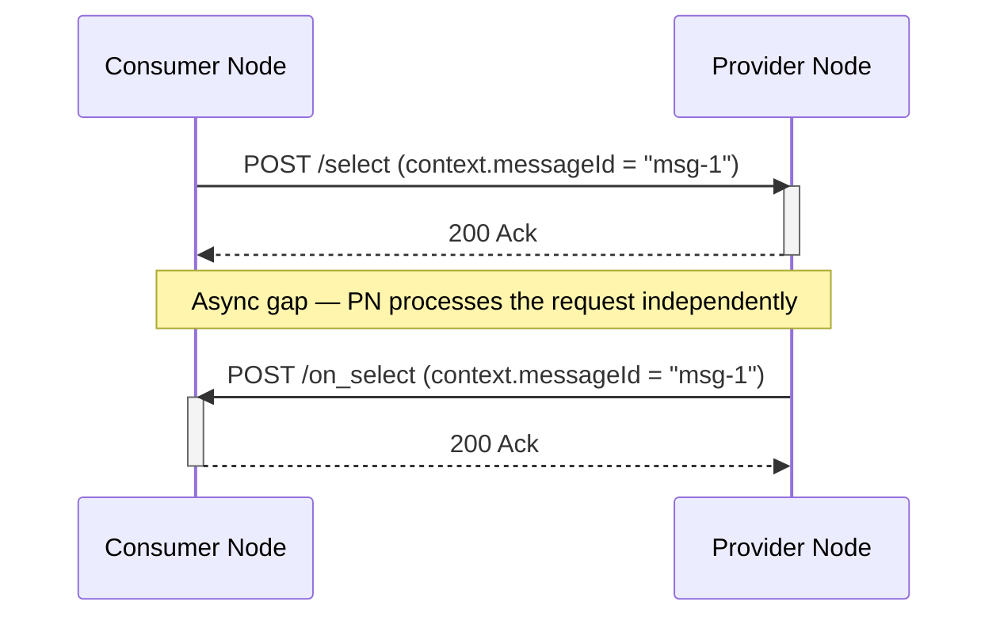
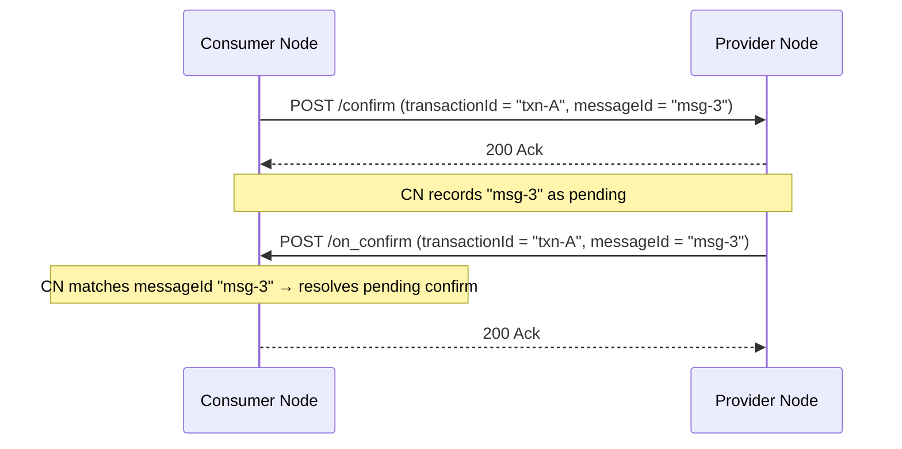
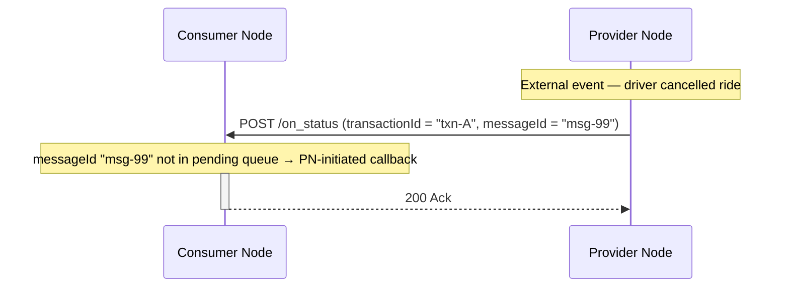
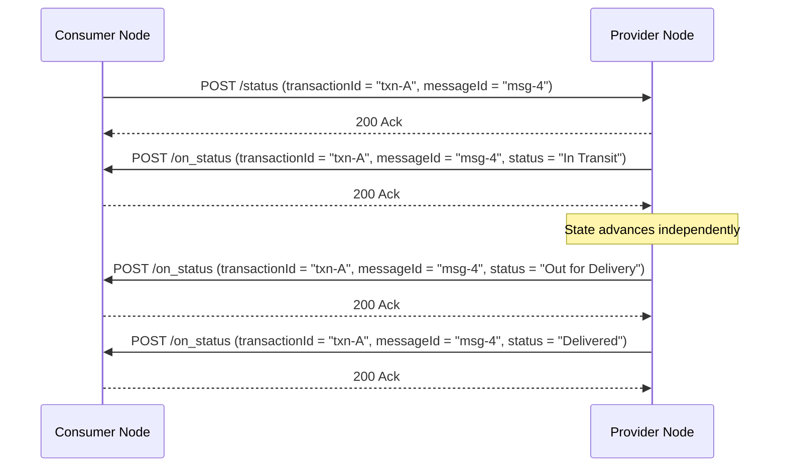
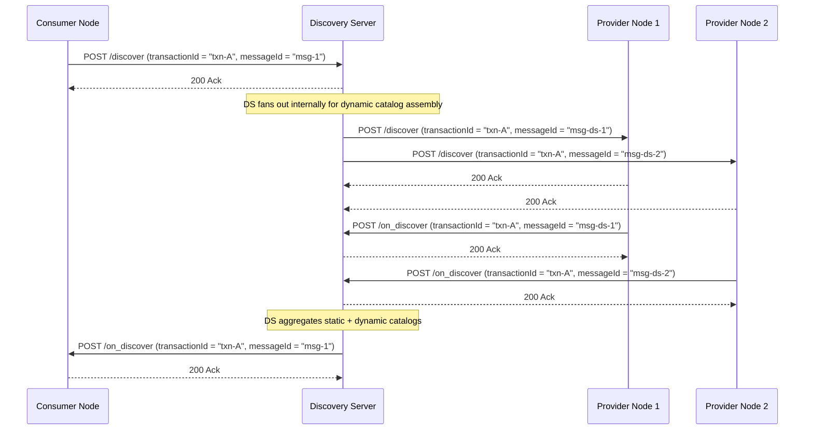
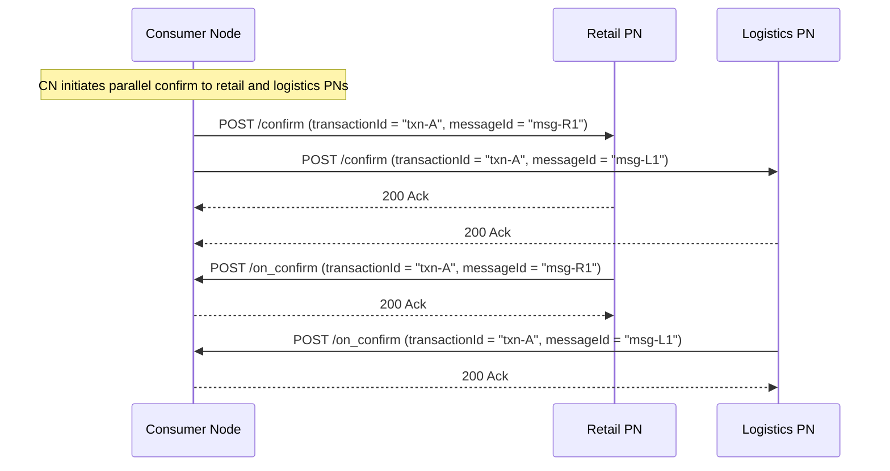
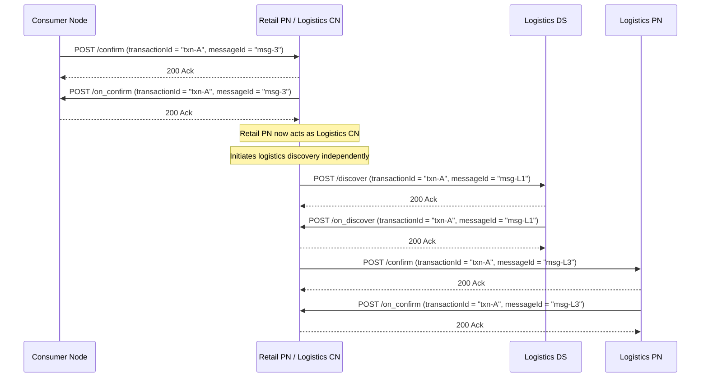

# Beckn Communication Model

## Document Details

- **ID:** NFH-013
- **Status:** Draft.
- **Authors:**
  - [Ravi Prakash](https://github.com/ravi-prakash-v), [Networks for Humanity](https://networksforhumanity.org)
- **Created:** 2026-05-15
- **Updated:** 2026-05-16
- **Version history:** Draft-01 (2026-05-15): Initial publication. Draft-02 (2026-05-16): Add stateless model, session management, multicast flows, cascaded networks; rename PN-initiated callbacks; update discovery to CN↔DS.
- **Latest editor's draft:** Click [here](https://github.com/beckn/protocol-specifications-v2/blob/draft/docs/Communication_Protocol.md).
- **Implementation report:** Not available. This document is at Initial Draft status; report will be linked in the next formal release of this RFC, following merge to main.
- **Stress test report:** Not available. This document is at Initial Draft status; report will be linked in the next formal release of this RFC, following merge to main.
- **Conformance impact:** Not determined. This document is at Initial Draft status; impact will be classified in the next formal release of this RFC, following merge to main.
- **Security/privacy implications:** Defines the message-level security boundary — each transport hop must be independently authenticated; PN-initiated callbacks received without a valid request signature MUST be rejected to prevent injection attacks.
- **Replaces / Relates to:** Modernises [BECKN-RFC-003 Beckn Protocol Communication Draft-01](https://github.com/beckn/protocol-specifications/blob/master/docs/BECKN-003-Beckn-Protocol-Communication-Draft-01.md); relates to [NFH-006 Beckn API Endpoints](./API.md) and [NFH-007 Authentication and Trust](./Authentication_and_Trust.md). The independent-workflow implications of the stateless model are further developed in [NFH-TBD Independent Workflows](https://github.com/beckn/protocol-specifications-v2/blob/draft/docs/Independent_Workflows.md) (under draft).
- **Feedback:**
  - Issues: Click [here](https://github.com/beckn/protocol-specifications-v2/issues?q=is%3Aissue+label%3A%22NFH-013%22)
  - Discussions: Click [here](https://github.com/beckn/protocol-specifications-v2/discussions?discussions_q=label%3A%22NFH-013%22)
  - Pull Requests: Click [here](https://github.com/beckn/protocol-specifications-v2/pulls?q=is%3Apr+label%3A%22NFH-013%22)
- **Errata:** To be published.

## Abstract

This RFC defines how nodes on a Beckn-enabled fabric exchange messages. It specifies the asynchronous messaging model and its HTTP implementation as a request–callback pattern with synchronous acknowledgements (Ack and Nack variants). It establishes that Beckn Protocol is stateless — each message declares a node's own state rather than commanding the other node to change — and that a PN Ack obligates the PN to deliver a callback. It covers how `context.messageId` correlates a callback to its originating request, how `context.transactionId` scopes a session across multiple message pairs, multicast flows for discovery and parallel value chains, and how Beckn nodes compose into cascaded networks where confirmation on one layer does not automatically cascade to another.

## Table of Contents

- [Beckn Communication Model](#beckn-communication-model)
  - [Document Details](#document-details)
  - [Abstract](#abstract)
  - [Table of Contents](#table-of-contents)
  - [Introduction](#introduction)
  - [Specification](#specification)
    - [Definitions](#definitions)
    - [Normative Requirements](#normative-requirements)
      - [1. Node-to-Node Communication](#1-node-to-node-communication)
      - [2. The Request–Callback Pattern](#2-the-requestcallback-pattern)
      - [3. Ack and Nack Semantics](#3-ack-and-nack-semantics)
      - [4. Stateless Communication Model](#4-stateless-communication-model)
      - [5. Message Correlation — context.messageId](#5-message-correlation--contextmessageid)
      - [6. Transaction Scoping — context.transactionId](#6-transaction-scoping--contexttransactionid)
      - [7. Session Management](#7-session-management)
      - [8. PN-Initiated Callbacks](#8-pn-initiated-callbacks)
      - [9. Multiple Callbacks for a Single Request](#9-multiple-callbacks-for-a-single-request)
      - [10. Multicast Flows](#10-multicast-flows)
        - [10.1 Discovery Multicast](#101-discovery-multicast)
        - [10.2 Parallel Request Multicast](#102-parallel-request-multicast)
      - [11. Cascaded and Parallel Networks](#11-cascaded-and-parallel-networks)
    - [Conformance Requirements](#conformance-requirements)
    - [Cross-cutting Considerations](#cross-cutting-considerations)
    - [Migration Notes](#migration-notes)
    - [Examples](#examples)
      - [Example 1 — Correlated request and callback envelopes](#example-1--correlated-request-and-callback-envelopes)
      - [Example 2 — Shared transactionId across a multi-step transaction](#example-2--shared-transactionid-across-a-multi-step-transaction)
  - [Conclusion](#conclusion)
  - [Frequently Asked Questions](#frequently-asked-questions)
  - [Acknowledgements](#acknowledgements)
  - [References](#references)

## Introduction

Beckn Protocol enables a fabric of interconnected nodes to exchange value by:

1. publishing and discovering catalogs,
2. negotiating pricing and terms,
3. creating and modifying contracts,
4. tracking the performance (fulfillment) of those contracts,
5. building reputations by exchanging ratings and feedback, and
6. enabling customer and provider support.

This exchange happens through asynchronous messaging between nodes. While Beckn Protocol can be implemented on any communication infrastructure, this RFC describes its HTTP implementation, in which every message exchange takes the form of a request paired with a synchronous acknowledgement response, followed asynchronously by a callback paired with its own synchronous acknowledgement response.

This design reflects real-world business behaviour. A booking confirmation does not always arrive in milliseconds. A driver may cancel a confirmed ride before pickup without the consumer having asked for an update. A fulfillment status may change multiple times while a delivery is in transit. Asynchronous messaging makes all of these patterns expressible without the initiating node polling or holding an open connection.

The rules governing how messages flow between nodes — how to acknowledge, how to correlate a callback with its originating request, how to scope a session across multiple exchanges, and how nodes compose into multicast and cascaded flows — are the subject of this RFC.

## Specification

The key words "MUST", "MUST NOT", "REQUIRED", "SHALL", "SHALL NOT", "SHOULD", "SHOULD NOT", "RECOMMENDED", "MAY", and "OPTIONAL" in this document are to be interpreted as described [here](./Keyword_Definitions.md). These definitions aim to ensure that the terms are understood precisely and consistently to avoid confusion in the interpretation of standards, specifications, and protocols.

### Definitions

- **Consumer Node (CN):** A node that initiates forward requests and receives callbacks. Formerly called BAP.
- **Provider Node (PN):** A node that receives forward requests, sends immediate acknowledgements, and later delivers callbacks. Formerly called BPP.
- **Discovery Server (DS):** A node that hosts catalogs and responds to `discover` requests from CNs. To build a dynamic catalog (e.g., real-time availability), a DS may fan out `discover` internally to multiple PNs and aggregate their responses — along with any statically held catalog data — before sending a single `on_discover` back to the CN. A DS MAY also send multiple paginated `on_discover` callbacks for a single `discover` request. Direct forwarding of PN responses to the CN without aggregation is deprecated in Beckn v2. Formerly called BG (Beckn Gateway).
- **Forward request:** A message sent from a CN to a PN (or from a CN to a DS for discovery) carrying a `context` and `message` payload. The action name corresponds to a Beckn lifecycle step (e.g., `discover`, `select`, `confirm`). When implemented on HTTP, this is a POST request.
- **Callback:** A message sent in the reverse direction carrying a `context` and `message` payload. The action name is the forward action name prefixed with `on_` (e.g., `on_discover`, `on_select`, `on_confirm`). When implemented on HTTP, this is a POST request.
- **Ack:** A synchronous HTTP response indicating that the receiving node accepted and queued the request for processing. An Ack is not a business response.
- **Nack:** A synchronous HTTP response indicating that the receiving node rejected the request. No callback will follow a Nack.
- **`context.messageId`:** A UUID assigned by the initiating node to a single forward request. The responding node echoes this value in the corresponding callback, allowing the initiator to correlate the callback to its originating request.
- **`context.transactionId`:** A UUID assigned at the start of a session and carried unchanged across every forward request and callback that belongs to that session. It groups all message pairs — including parallel and cascaded ones — into a single logical unit of work.
- **PN-initiated callback:** A callback sent by a PN to a CN within an active transaction, without a corresponding prior forward request from the CN. The PN assigns a fresh `messageId`.
- **Request signature:** The HTTP Signature value in the `Authorization` header, used to authenticate the sender of any message. Every message — including PN-initiated callbacks — MUST carry a valid request signature.

### Normative Requirements

#### 1. Node-to-Node Communication

Beckn Protocol defines an asynchronous messaging model between nodes. The client application — a mobile app, a web browser, or an AI Agent's tool-call surface — is not part of the protocol layer. Either node MAY be operated by an AI Agent without a human in the loop for any individual message exchange.

When implemented on HTTP, the following apply:

- The CN MUST expose a publicly reachable HTTPS endpoint to receive callbacks from PNs.
- The PN MUST expose a publicly reachable HTTPS endpoint to receive forward requests from CNs.
- Neither node MUST involve the end-user's client application in the HTTP exchange.

#### 2. The Request–Callback Pattern

The canonical communication unit is a two-step exchange. The initiating node sends a forward request and receives an immediate synchronous Ack. The receiving node processes the request independently and later sends a callback to the initiator's endpoint, which the initiator acknowledges synchronously.



The callback action name is always the forward action name prefixed with `on_`. Discovery (`discover` / `on_discover`) flows between a CN and a DS; all other lifecycle actions (`select`, `init`, `confirm`, `status`, `update`, `cancel`, `track`, `rate`, `support`) flow between a CN and a PN. For the full lifecycle mapping see [NFH-006 Beckn API Endpoints](./API.md).

#### 3. Ack and Nack Semantics

Every forward request and every callback MUST receive a synchronous HTTP response. The response communicates transport-level acceptance or rejection only — it is never a business response.

The response families defined in `api/v2.0.0/beckn.yaml` are:

| HTTP Status | Response Name | Meaning |
|---|---|---|
| 200 | `Ack` | Request received, authenticated, and queued for processing. A callback will follow. |
| 202 | `AckNoCallback` | Request received and authenticated, but the PN has determined that no callback will follow (e.g., no matching catalog, provider closed, inventory unavailable). |
| 400 | `NackBadRequest` | Request body is structurally invalid or fails semantic validation. The sender MUST correct the request before retrying. |
| 401 | `NackUnauthorized` | The HTTP Signature is absent, expired, or fails Registry key verification. The sender MUST obtain a valid signature before retrying. |
| 403 | `NackDiscretionary` | The receiving node declines engagement for policy-governed reasons (insufficient caller trust, capacity limits, scheduled inactivity). No callback will follow. |
| 409 | `NackConflict` | Request conflicts with existing persisted state (e.g., a subscription with the same criteria already exists for this subscriber). The sender MUST resolve the conflict before retrying. |
| 429 | `NackTooManyRequests` | Rate limit or capacity limit exceeded. The sender MUST apply back-off before retrying. The response SHOULD include a `Retry-After` header. |
| 500 | `ServerError` | An internal error prevented the receiving node from processing the request. |

Key rules:

- A CN MUST NOT treat an `Ack` as the business response to its request. The business response arrives only in the callback.
- A PN that returns `Ack` (200) is obligated to deliver a callback. The PN is under no obligation to deliver that callback immediately, but MUST deliver it within the bounds of the transaction lifecycle.
- After receiving any Nack, no callback will follow for that `messageId`. The CN MAY retry with a new `messageId`.
- After receiving `AckNoCallback`, the CN MUST NOT wait for a callback. The CN MAY initiate a fresh forward request.
- Every synchronous response MUST carry a `Signature` response header as defined in [NFH-007 §5](./Authentication_and_Trust.md). The sending node MUST verify this header.

#### 4. Stateless Communication Model

Beckn Protocol is stateless. No node is required to maintain shared session state with another node. Each message declares the sending node's own state at the time of sending; it does not instruct the receiving node to adopt that state.

**State declaration, not state synchronisation.** When a PN sends an `on_confirm` callback, it is communicating its own view of the contract — not commanding the CN to update its internal records to match. The CN is free to accept that state and take no further action. The PN MUST NOT expect a follow-up message from the CN simply because a callback was delivered. Equally, a forward request from a CN does not obligate the PN to change its internal state — the PN responds with its own state in the callback.

**Disagreement and rejection.** If a node explicitly disagrees with the state communicated by the other node, it MUST communicate that disagreement by sending a Nack (in the case of a synchronous response) or by initiating a new forward request (e.g., a `cancel` or `update`). Silence is not rejection.

**The PN Ack obligation.** The one exception to the no-obligation rule is the PN's Ack: when a PN returns `Ack` (HTTP 200) to a CN's forward request, it commits to delivering a callback for that `messageId`. This is the PN's declaration that it has accepted the request for processing and will respond with its state. The timing of the callback is at the PN's discretion; the CN MUST NOT block its own workflow waiting for the callback to arrive.

**Anti-pattern: CN blocking on PN state.** A common implementation error is for the CN to pause its own workflow — holding a user-visible loading state, deferring downstream actions, or queuing subsequent requests — until the PN's callback arrives. This is incorrect. The CN SHOULD advance its own workflow using the last known state and handle the arriving callback as an incremental update. The independent workflow model for both nodes is developed further in [NFH-TBD Independent Workflows](https://github.com/beckn/protocol-specifications-v2/blob/draft/docs/Independent_Workflows.md) (under draft).

#### 5. Message Correlation — context.messageId

A `messageId` uniquely identifies a single forward request and its corresponding callback. The initiating node assigns the `messageId` when constructing the forward request. The responding node copies the same `messageId` into the callback without modification. This allows the initiator to match each arriving callback to the specific request that triggered it.



- The initiating node MUST assign a globally unique value to `context.messageId` for each forward request.
- The responding node MUST echo the `context.messageId` from the forward request unchanged in the corresponding callback.
- The CN SHOULD maintain a record of pending `messageId` values to match arriving callbacks. A callback whose `messageId` does not match any pending request is either a PN-initiated callback (see §8) or a duplicate and SHOULD be handled accordingly.
- A CN MAY retire a `messageId` from its active pending record once the corresponding callback has been received. There is no requirement to retain it in memory beyond that point.
- A `messageId` MUST NOT be reused across different requests within or across transactions. It is RECOMMENDED to always generate a fresh `messageId` for each outgoing request rather than recycling a previously used value, even one that has been retired from the pending record.

#### 6. Transaction Scoping — context.transactionId

A business transaction spans multiple request–callback pairs. The entire sequence from discovery through fulfillment belongs to a single logical unit of work, scoped by a `transactionId` that is constant across every message in that transaction.

```mermaid
sequenceDiagram
    participant CN as Consumer Node
    participant DS as Discovery Server
    participant PN as Provider Node

    CN->>DS: POST /discover (transactionId = "txn-A", messageId = "msg-1")
    DS-->>CN: 200 Ack
    DS->>CN: POST /on_discover (transactionId = "txn-A", messageId = "msg-1")
    CN-->>DS: 200 Ack

    CN->>PN: POST /select (transactionId = "txn-A", messageId = "msg-2")
    PN-->>CN: 200 Ack
    PN->>CN: POST /on_select (transactionId = "txn-A", messageId = "msg-2")
    CN-->>PN: 200 Ack

    CN->>PN: POST /confirm (transactionId = "txn-A", messageId = "msg-3")
    PN-->>CN: 200 Ack
    PN->>CN: POST /on_confirm (transactionId = "txn-A", messageId = "msg-3")
    CN-->>PN: 200 Ack

    Note over CN,DS,PN: All messages share transactionId "txn-A"
    Note over CN,DS,PN: Each request–callback pair has its own messageId
```

- The CN MUST assign a `transactionId` at the start of a business transaction and MUST NOT change it for the duration of that transaction.
- Every forward request and every callback belonging to the same transaction MUST carry the same `transactionId`.
- The `transactionId` MUST NOT be reused across different business transactions.
- The responding node MUST copy the `transactionId` from the forward request into every callback.
- The `transactionId` serves as the join key for reconstructing a complete transaction audit trail across all messages.

#### 7. Session Management

The `messageId` and `transactionId` together form the session management layer of the Beckn communication model. They operate at different scopes and serve different purposes.

| Field | Scope | Assigned by | Purpose |
|---|---|---|---|
| `context.messageId` | Single request–callback pair | Initiating node | Correlate a specific callback to its originating request |
| `context.transactionId` | Entire business session | CN (at session start) | Group all message pairs — sequential, parallel, or multicast — into one logical transaction |

**When to create a new `transactionId`.** A new `transactionId` MUST be created when a genuinely new business session begins — a fresh discovery, a new order, a new support ticket. A `transactionId` MUST NOT be recycled from a previous completed or abandoned transaction.

**When to create a new `messageId`.** A new `messageId` MUST be created for every outbound forward request, even within the same transaction. In multicast flows (see §10), the DS or CN assigns a distinct `messageId` to each individual node it addresses, while keeping the `transactionId` constant.

**Parallel message pairs under a single session.** When a transaction involves multiple simultaneous request–callback pairs — for example, a retail order and a parallel logistics booking — all pairs share the same `transactionId`. Each pair carries its own `messageId`. The `transactionId` is the key that ties these parallel flows into a single session; the `messageId` is the key that allows each individual pair to be correlated independently.

**Session lifecycle.** A session begins when the CN assigns a `transactionId` and ends when the transaction reaches a terminal state (fulfilled, cancelled, or expired). There is no explicit session-close message. Nodes SHOULD retain session state for a duration appropriate to the transaction domain.

**Message deduplication.** Both `messageId` and `transactionId` MUST be UUIDs. While UUID collisions within a single node are statistically rare, the scale of agentic deployments — potentially trillions of messages across many nodes — makes long-term deduplication a practical concern. It is RECOMMENDED that a message sender treat the combination of `context.messageId` and its outgoing request signature as the unique key for deduplication. This pairing is effectively collision-proof because the signature is derived from message content and the sender's private key, making it unique even if two messages share the same `messageId` by chance. This is a recommendation only; a node MAY pair `messageId` with any other value it controls to achieve deduplication suited to its own operational requirements.

#### 8. PN-Initiated Callbacks

A PN may need to inform a CN of a state change that the CN did not request. A driver cancelling a confirmed ride, a fulfillment status update triggered by an external event, or a provider closing an active service window are all examples of events that originate on the PN side and must be communicated to the CN without the CN having requested an update.

These are called PN-initiated callbacks. The PN sends an `on_*` message to the CN carrying the active `transactionId` and a fresh `messageId`.



- The PN MAY send a PN-initiated callback at any time within an active transaction.
- The PN MUST include the `transactionId` of the active transaction in a PN-initiated callback.
- The PN MUST assign a fresh `messageId` to a PN-initiated callback; it MUST NOT reuse a `messageId` from a prior request in the same transaction.
- The PN MUST include a valid request signature (HTTP Signature in the `Authorization` header) in every PN-initiated callback. A CN MUST reject any PN-initiated callback that does not carry a valid request signature.
- The CN MUST accept and process authenticated PN-initiated callbacks. A CN MUST NOT reject a callback solely because its `messageId` does not match a pending forward request.
- The CN SHOULD use the absence of a matching pending `messageId` as a signal that the callback is PN-initiated and handle it accordingly (e.g., surface the event to the application layer without resolving a pending operation).

#### 9. Multiple Callbacks for a Single Request

Some forward requests may trigger more than one callback from the PN. The `status` action is the canonical example: after the CN sends a `status` request and receives `on_status`, the PN may continue sending additional `on_status` callbacks as the fulfillment state advances, without the CN needing to re-issue `status` each time.



- A PN MAY send multiple callbacks carrying the same `messageId` if the action semantics permit it.
- The CN MUST accept and process each callback independently. The CN MUST NOT discard a callback solely because a prior callback with the same `messageId` was already received.
- The CN SHOULD treat later callbacks with the same `messageId` as incremental state updates for the same request.

#### 10. Multicast Flows

Beckn Protocol supports multicast patterns in which a single logical request is fanned out to multiple nodes simultaneously. In all multicast flows, the `transactionId` remains constant across the fan-out while each individual addressed node receives its own distinct `messageId`. This allows the originating node to correlate each response independently while still associating all responses with the same session.

##### 10.1 Discovery Multicast

When the CN sends a `discover` request, the DS is responsible for assembling the full catalog response. For dynamic catalogs — for example, a mobility search where available options depend on the consumer's real-time location — the DS fans out the `discover` internally to multiple PNs. Each PN addressed in the fan-out receives the same `transactionId` but a distinct `messageId` assigned by the DS. The DS collects the PN responses and merges them with any statically held catalog data before sending the aggregated `on_discover` back to the CN. The CN sees a single request–callback pair regardless of how many PNs the DS consulted.



**Paginated responses.** If the aggregated catalog is large, the DS MAY send multiple `on_discover` callbacks for the single `discover` request, each carrying the same `messageId`. The CN MUST treat each arriving `on_discover` as an additional page of the same result set (consistent with the multiple-callbacks pattern in §9) and MUST NOT discard later pages.

**CN calling PNs directly.** A CN is not required to use a DS. A CN MAY call individual PNs directly using the parallel multicast pattern (see §10.2), treating each PN as an independent discover target and aggregating responses at the CN. This is appropriate when the CN already knows which PNs to query.

- The DS MUST use the same `transactionId` from the CN's `discover` request when fanning out to PNs.
- The DS MUST assign a distinct `messageId` for each PN it addresses in the internal fan-out.
- The DS MUST aggregate all PN responses together with any static catalog data before sending `on_discover` to the CN.
- PNs MUST direct their `on_discover` callbacks to the DS (not to the CN) when responding to a DS-initiated fan-out.
- Direct forwarding of PN `on_discover` responses to the CN without DS aggregation is deprecated in Beckn v2 and MUST NOT be implemented.

##### 10.2 Parallel Request Multicast

A CN may also multicast a non-discovery request to multiple PNs simultaneously to fulfil parallel value chains. A retail order and a logistics booking are a common example: the CN confirms the retail contract with one PN and simultaneously arranges fulfillment with a logistics PN, both within the same transaction.



- In a parallel multicast, the CN MUST assign a distinct `messageId` for each PN it addresses.
- All parallel message pairs within the same session MUST carry the same `transactionId`.
- The CN uses `messageId` to correlate each arriving `on_*` callback to the correct parallel leg of the transaction.

#### 11. Cascaded and Parallel Networks

Beckn Protocol supports cascaded network architectures in which a single node participates in more than one transaction layer simultaneously. A node may act as a PN in one transaction while simultaneously acting as a CN in a related transaction on a different layer.

**Confirmation does not cascade automatically.** An `on_confirm` received from a PN on one layer does not automatically trigger a `confirm` on a downstream layer. Each layer is an independent Beckn transaction. The node acting at the boundary decides when and whether to initiate downstream flows, based on its own business logic.

**Example: Retail PN as Logistics CN.** When a consumer confirms a retail order, the Retail PN receives an `on_confirm` from its upstream CN. The Retail PN may then need to arrange logistics fulfillment independently. To do so, it acts as a Logistics CN — initiating a fresh discovery flow to Logistics PNs, negotiating terms, and confirming a logistics contract. This is a separate Beckn transaction, but it MAY share the original `transactionId` to preserve end-to-end traceability.



- A node acting as a PN in one transaction MAY simultaneously act as a CN in a downstream transaction on a different layer.
- Confirmation or any other action on one layer MUST NOT be assumed to automatically trigger the corresponding action on a downstream layer.
- A cascaded flow MAY share the originating `transactionId` across layers to maintain end-to-end traceability, or MAY create a new `transactionId` for the downstream layer. The choice is at the implementing node's discretion.
- Each layer of the cascade is subject to the same Beckn communication rules defined in this RFC, including independent authentication of every message hop.

### Conformance Requirements

| ID | Requirement | Level |
|---|---|---|
| CON-013-01 | A CN MUST NOT block waiting for a callback in the same HTTP session as the forward request. | MUST NOT |
| CON-013-02 | A PN MUST respond to every forward request with a synchronous HTTP response (Ack or Nack) before processing the request body asynchronously. | MUST |
| CON-013-03 | A PN that returns Ack (HTTP 200) to a forward request MUST subsequently deliver a callback for that `messageId`. | MUST |
| CON-013-04 | A responding node MUST echo `context.messageId` from the forward request unchanged in the corresponding callback. | MUST |
| CON-013-05 | All messages belonging to a single business transaction MUST carry the same `context.transactionId`. | MUST |
| CON-013-06 | An initiating node MUST assign a globally unique `context.messageId` for each forward request. | MUST |
| CON-013-07 | A CN MUST expose a publicly reachable HTTPS callback endpoint capable of receiving both solicited and PN-initiated callbacks from any PN. | MUST |
| CON-013-08 | A CN MUST NOT treat an `Ack` response as the business response to a forward request. | MUST NOT |
| CON-013-09 | A PN returning `AckNoCallback` (HTTP 202) MUST NOT subsequently send a callback for that `messageId`. | MUST NOT |
| CON-013-10 | After any Nack response, no callback will follow. The CN MAY retry the request with a new `messageId`. | MAY |
| CON-013-11 | A CN MUST NOT block its own workflow awaiting a PN callback. The CN SHOULD advance its own state using the last known information. | MUST NOT |
| CON-013-12 | A CN MUST accept and process authenticated PN-initiated callbacks. A CN MUST NOT reject a callback solely because its `messageId` does not match a pending forward request. | MUST |
| CON-013-13 | A PN sending a PN-initiated callback MUST include the active `context.transactionId` and MUST assign a fresh `context.messageId`. | MUST |
| CON-013-14 | A CN MUST reject any PN-initiated callback that does not carry a valid request signature. | MUST |
| CON-013-15 | A CN MUST NOT discard a callback solely because a prior callback with the same `messageId` was already received. | MUST NOT |
| CON-013-16 | A `messageId` MUST NOT be reused across different requests within or across transactions. | MUST NOT |
| CON-013-17 | The `transactionId` MUST NOT be reused across different business transactions. | MUST NOT |
| CON-013-18 | Every node MUST authenticate each incoming message independently, regardless of prior messages in the same transaction. See [NFH-007](./Authentication_and_Trust.md). | MUST |
| CON-013-19 | In any multicast fan-out (DS to PNs, or CN to PNs directly), the fanning-out node MUST assign a distinct `messageId` for each node it addresses while keeping the `transactionId` constant. | MUST |
| CON-013-20 | Confirmation or any other action on one network layer MUST NOT be assumed to automatically trigger the corresponding action on a downstream layer. | MUST NOT |
| CON-013-21 | `context.messageId` MUST be a UUID. | MUST |
| CON-013-22 | `context.transactionId` MUST be a UUID. | MUST |
| CON-013-23 | A message sender SHOULD treat the combination of `context.messageId` and its outgoing request signature as the unique deduplication key for long-term message deduplication. | SHOULD |
| CON-013-24 | A DS MUST aggregate all PN responses and static catalog data before sending `on_discover` to the CN. Direct forwarding of PN `on_discover` responses to the CN MUST NOT be implemented. | MUST |
| CON-013-25 | A DS MAY send multiple paginated `on_discover` callbacks for a single `discover` request. The CN MUST NOT discard later pages. | MAY |

### Cross-cutting Considerations

**Security.** Every message exchange is an independent HTTP session and must be independently authenticated. Receiving a valid message from a PN in one step of a transaction does not authorize subsequent messages from that PN without fresh signature verification. Implementations MUST enforce [NFH-007 Authentication and Trust](./Authentication_and_Trust.md) on every incoming forward request and every incoming callback, including PN-initiated callbacks. A PN-initiated callback that arrives without a valid request signature is indistinguishable from a spoofed message; the CN MUST reject it.

**Privacy.** The `transactionId` is a persistent session correlation handle. Implementers SHOULD treat `transactionId` values as sensitive identifiers and MUST NOT expose them in logs, metrics labels, or error messages accessible to parties outside the transaction.

**AI Agent exercisability.** Every flow defined in this RFC — including multicast and cascaded flows — is exercisable by an AI Agent without human intervention. Because the protocol is stateless and each node manages its own state independently, agentic implementations can be structured as event-driven tool calls that process arriving callbacks asynchronously and advance their own workflow without polling or blocking.

### Migration Notes

This RFC formalises communication behaviour that has been implicitly expected since Beckn v1. No wire-format changes are introduced. Implementations conformant with prior drafts that correctly implement asynchronous request–callback semantics, `messageId` echo, and shared `transactionId` already satisfy the majority of requirements in this RFC without modification.

The following changes require implementer attention:

- `search` / `on_search` are replaced by `discover` / `on_discover` in Beckn v2. These endpoints involve the DS rather than a direct CN↔PN exchange.
- The pattern in which a DS forwards PN `on_discover` responses directly to the CN without aggregation (as used in Beckn v1 BG implementations) is deprecated. The DS MUST aggregate all responses before delivering `on_discover` to the CN.
- Implementations that rely on synchronous business responses (i.e., expecting the Ack to carry order or fulfillment data) MUST be refactored to consume the callback endpoint.
- Implementations in which the CN blocks its workflow awaiting PN state SHOULD be refactored to adopt an independent-workflow model. See [NFH-TBD Independent Workflows](https://github.com/beckn/protocol-specifications-v2/blob/draft/docs/Independent_Workflows.md) (drafted on `draft` branch, undergoing review).

### Examples

#### Example 1 — Correlated request and callback envelopes

A CN sends a `confirm` request. The PN echoes the `messageId` in `on_confirm`, allowing the CN to resolve the pending operation.

**Forward request (CN → PN):**

```json
{
  "context": {
    "version": "2.0.0",
    "action": "confirm",
    "transactionId": "txn-f7e3c2a1",
    "messageId": "msg-9b4d1e77",
    "timestamp": "2026-05-15T10:00:00Z",
    "bapId": "cn.example.org",
    "bapUri": "https://cn.example.org/beckn",
    "bppId": "pn.example.org",
    "bppUri": "https://pn.example.org/beckn"
  },
  "message": {
    "order": {}
  }
}
```

**Synchronous Ack (PN → CN, same session):**

```json
{
  "context": {
    "action": "confirm",
    "messageId": "msg-9b4d1e77"
  },
  "message": {
    "status": "ACK",
    "messageId": "msg-9b4d1e77"
  }
}
```

**Callback (PN → CN, separate session):**

```json
{
  "context": {
    "version": "2.0.0",
    "action": "on_confirm",
    "transactionId": "txn-f7e3c2a1",
    "messageId": "msg-9b4d1e77",
    "timestamp": "2026-05-15T10:00:02Z",
    "bapId": "cn.example.org",
    "bapUri": "https://cn.example.org/beckn",
    "bppId": "pn.example.org",
    "bppUri": "https://pn.example.org/beckn"
  },
  "message": {
    "order": {
      "id": "ord-001",
      "status": "ACTIVE"
    }
  }
}
```

The CN matches the callback to its pending `confirm` operation using `messageId = "msg-9b4d1e77"`.

#### Example 2 — Shared transactionId across a multi-step transaction

A discover–select–confirm sequence. All messages share `transactionId = "txn-f7e3c2a1"`; each request–callback pair uses a distinct `messageId`.

| Step | Action | Nodes | transactionId | messageId |
|---|---|---|---|---|
| 1 | `discover` | CN → DS | `txn-f7e3c2a1` | `msg-1a` |
| 1 | `on_discover` | DS → CN | `txn-f7e3c2a1` | `msg-1a` |
| 2 | `select` | CN → PN | `txn-f7e3c2a1` | `msg-2b` |
| 2 | `on_select` | PN → CN | `txn-f7e3c2a1` | `msg-2b` |
| 3 | `confirm` | CN → PN | `txn-f7e3c2a1` | `msg-3c` |
| 3 | `on_confirm` | PN → CN | `txn-f7e3c2a1` | `msg-3c` |

Any message in this table can be associated with the full session using `transactionId`. Any specific request–callback pair can be identified using `messageId`.

## Conclusion

This RFC establishes the normative rules for message-level communication on a Beckn-enabled fabric. Implementations that conform to this RFC will correctly handle the two-step request–callback pattern, the stateless state-declaration model, message correlation and session scoping via `messageId` and `transactionId`, PN-initiated callbacks, multicast discovery and parallel value chains, and cascaded network compositions. These rules apply uniformly to AI Agents and conventional software clients alike.

Advancement of this RFC to Candidate status requires at least two independent implementations demonstrating conformance with CON-013-01 through CON-013-25, with particular attention to the PN callback obligation (CON-013-03), PN-initiated callback authentication (CON-013-14), multicast `messageId` assignment (CON-013-19), UUID format requirements (CON-013-21 and CON-013-22), and DS aggregation (CON-013-24).

## Frequently Asked Questions

**Q: Must `messageId` and `transactionId` be UUIDs, or can any unique string be used?**

Both MUST be UUIDs (CON-013-21, CON-013-22). A UUID is required rather than an arbitrary unique string because its collision probability is well-understood and its format is interoperable across all implementations without requiring a coordination mechanism.

**Q: How long should a CN keep a `messageId` in memory? Is there a timeout?**

A CN MAY retire a `messageId` from its active pending record as soon as the corresponding callback has been received — there is no obligation to retain it beyond that point. There is no normative timeout on how long to wait for a callback before giving up; this is left to the transaction domain and the CN's business logic. It is RECOMMENDED to always generate a fresh `messageId` for each new outbound request rather than recycling a previously retired one, even though retired values are technically no longer in active use.

**Q: Does using the same `transactionId` across multiple networks create reconciliation problems for network operators?**

No. Network operators have no role in `transactionId` management. All Beckn communication is point-to-point between a CN and a PN; the network or networks they belong to are irrelevant to the protocol. There is no rule preventing a node from using the same `transactionId` across multiple networks, and no namespace or prefix mechanism is required.

**Q: In a discovery multicast, should the DS forward individual PN responses directly to the CN, or aggregate them first?**

The DS MUST aggregate all responses — from static catalog data and from dynamic PN callbacks — before sending `on_discover` to the CN (CON-013-24). Direct forwarding of PN `on_discover` responses to the CN was the Beckn v1 BG pattern and is deprecated in Beckn v2. If the aggregated catalog is large, the DS MAY send it in multiple paginated `on_discover` callbacks, each carrying the same `messageId` as the original `discover` request (CON-013-25). A CN that does not want to use a DS MAY call PNs directly using the parallel multicast pattern and aggregate responses itself.

---

**Q: What is the difference between `AckNoCallback` (202) and `NackDiscretionary` (403)? Both seem to mean "no further action."**

They are different in intent. `AckNoCallback` means the PN received and authenticated the request without any problem, but has nothing to say in response — for example, no catalog matched the discovery query, or the provider's inventory is empty. It is a valid, successful outcome with an empty result. `NackDiscretionary` means the PN chose not to engage at all — it is a refusal, not an empty result. A PN returning `AckNoCallback` would likely engage under different query parameters; a PN returning `NackDiscretionary` is declining based on policy, trust level, or capacity, regardless of the request content.

**Q: The protocol is described as "stateless," but nodes clearly store transaction data. What does stateless mean in this context?**

Stateless here means there is no shared, synchronized state between nodes — not that nodes store no state at all. Each node maintains its own independent internal state. What Beckn Protocol does not define or require is a mechanism for the two nodes to keep their state in sync. The protocol does not command nodes to adopt each other's state; each message declares what the sender's own state is at that moment. Both nodes may have different internal views of the transaction at any given time, and both are correct from their own perspective.

**Q: Can a CN send multiple different forward requests to the same PN within a single transaction?**

Yes. A typical transaction includes several distinct forward requests under the same `transactionId` — for example, `select`, `init`, and `confirm` are three separate forward requests, each with its own `messageId`, all sent to the same PN under a common `transactionId`. Each request–callback pair is independent and correlates via its own `messageId`.

**Q: Who assigns the `transactionId` — the CN or the PN?**

The CN assigns the `transactionId` at the start of the session. The PN copies it from every incoming forward request into every outgoing callback. The PN MUST NOT generate or modify the `transactionId`.

**Q: Can a PN also initiate a new transaction with a CN, or can only CNs initiate transactions?**

TBA.

**Q: What should a CN do if it receives an `on_confirm` from a PN but disagrees with the state declared in it — for example, the PN's `on_confirm` says the order status is `CANCELLED` but the CN expected `ACTIVE`?**

TBA.

**Q: What happens if a PN sends an Ack but then never delivers the promised callback?**

TBA.

**Q: What should a CN do after receiving a `ServerError` (500)? Should it retry with the same `messageId` or a new one?**

TBA.

**Q: Does one `status` request trigger all future `on_status` callbacks indefinitely, or does each `on_status` push require a new `status` request?**

A single `status` request can trigger multiple `on_status` callbacks from the PN without the CN re-issuing `status`. The PN may continue pushing state updates — "In Transit", "Out for Delivery", "Delivered" — all under the same `messageId` as the original request (see §9). The CN does not need to poll. However, the CN is also free to send a fresh `status` request at any time to explicitly request an update; this would create a new `messageId` and its own callback chain.

**Q: Is there a way for a CN to explicitly signal to a PN that a session is over?**

TBA.

**Q: In a cascaded flow, does the consumer-facing CN have any visibility into the downstream logistics transaction initiated by the Retail PN?**

TBA.

**Q: What should a CN do if it sends a parallel multicast to two PNs and one responds with Ack but the other responds with Nack or AckNoCallback?**

TBA.

**Q: Can Beckn Protocol be implemented over communication channels other than HTTP, such as WebSockets, MQTT, or a message queue?**

Yes. The protocol specifies an asynchronous messaging model that is transport-agnostic. HTTP is the reference implementation described in this RFC, but the request–callback pattern, `messageId` correlation, and `transactionId` scoping apply to any transport that can carry the Beckn `context` and `message` envelope. Transport-specific binding rules for non-HTTP implementations are outside the scope of this RFC.

## Acknowledgements

BECKN-RFC-003 (Ravi Prakash, Sujith Nair, Pramod Varma, 2021) provided the foundational concepts that this document formalises for Beckn Protocol v2.

## References

- **NFH-001 Architecture, Design Philosophy and Principles:** Click [here](./Introduction.md).
- **NFH-006 Beckn API Endpoints:** Click [here](./API.md).
- **NFH-007 Authentication and Trust:** Click [here](./Authentication_and_Trust.md).
- **NFH-008 Handling Exceptions and Errors:** Click [here](https://github.com/beckn/protocol-specifications-v2/blob/draft/docs/Error_Codes.md) (drafted on `draft` branch, undergoing review).
- **NFH-TBD Independent Workflows:** Click [here](https://github.com/beckn/protocol-specifications-v2/blob/draft/docs/Independent_Workflows.md) (under draft).
- **Keyword Definitions:** Click [here](./Keyword_Definitions.md).
- **Canonical OpenAPI contract:** `api/v2.0.0/beckn.yaml`.
- **Legacy reference:** [BECKN-RFC-003 Beckn Protocol Communication Draft-01](https://github.com/beckn/protocol-specifications/blob/master/docs/BECKN-003-Beckn-Protocol-Communication-Draft-01.md).
- **Governance:** Click [here](../GOVERNANCE.md).
