# Navigating the Beckn Schema

## Document Details

- **ID:** NFH-007
- **Status:** Draft.
- **Authors:** Beckn Protocol contributors.
- **Created:** 2026-04-08.
- **Updated:** 2026-04-08.
- **Version history:** No commits found on `main` for `docs/07_Navigating_The_Beckn_Schema.md`.
- **Latest editor's draft:** Click [here](https://github.com/beckn/protocol-specifications-v2/blob/draft/docs/07_Navigating_The_Beckn_Schema.md)
- **Implementation report:** To be published.
- **Stress test report:** To be published.
- **Conformance impact:** Informative with normative implementation guidance.
- **Security/privacy implications:** Clarifies schema validation responsibilities for safe processing.
- **Replaces / Relates to:** Replaces non-RFC-form content in `07_Navigating_The_Beckn_Schema.md`.
- **Feedback:** Issues Click [here](https://github.com/beckn/protocol-specifications-v2/issues?q=is%3Aissue+label%3A%22RFC-007%22), Discussions Click [here](https://github.com/beckn/protocol-specifications-v2/discussions?discussions_q=label%3A%22RFC-007%22), Pull Requests Click [here](https://github.com/beckn/protocol-specifications-v2/pulls?q=is%3Apr+label%3A%22RFC-007%22).
- **Errata:** To be published.

## Abstract

This RFC defines how implementers should navigate Beckn schema assets across OpenAPI contracts, core schema objects, JSON-LD extension containers, and registry-published versioned artifacts to preserve structural and semantic interoperability.

## Table of Contents

- [Introduction](#introduction)
- [Specification](#specification)
- [Conclusion](#conclusion)
- [Acknowledgements](#acknowledgements)
- [References](#references)

## Introduction

Beckn implementations consume both transport contracts and semantic schema artifacts. Without a common navigation model, independent implementations can diverge on contract precedence, extension handling, version discovery, and semantic interpretation. This document defines a consistent way to read and validate these assets so implementations remain structurally and semantically interoperable.

For this document, the canonical contract is `api/v2.0.0/beckn.yaml`, which is the primary OpenAPI artifact for envelope and operation constraints. Core schema objects are shared entities such as `Context`, `Ack`, `Contract`, `Catalog`, `Intent`, and `Support`, and they require structural validation before business execution. `Attributes` containers are designated extension points for domain-specific semantics and MUST NOT be used to change the meaning of inherited core fields. Structural validation refers to JSON Schema or OpenAPI conformance checks, while semantic validation refers to JSON-LD processing through `@context` and `@type` so that meaning is preserved across participants.

The guidance in this RFC follows four principles: contract fidelity, so `beckn.yaml` remains authoritative for transport shape; semantic composability, so extensions are carried through linked-data containers; dual validation, so structural and semantic checks complement each other; and version continuity, so schema versions evolve without changing canonical concept meaning.

## Specification

The key words MUST, SHOULD, and MAY in this document are to be interpreted as described in Click [here](./00_Keyword_Definitions.md).

### Data Model

```mermaid
classDiagram
    class Context {
        +action: string
        +version: string
        +bapId: string
        +bapUri: string
        +bppId: string
        +bppUri: string
        +transactionId: string
        +messageId: string
        +networkId: string
        +timestamp: string
        +key: string
        +try: boolean
        +ttl: string
        +schemaContext: string[]
        +requestDigest: RequestDigest
    }

    class Contract {
        +id: string
        +descriptor: Descriptor
        +commitments: Commitment[]
        +consideration: Consideration[]
        +participants: Participant[]
        +performance: Performance[]
        +settlements: Settlement[]
        +status: Descriptor
        +contractAttributes: Attributes
    }

    class Catalog {
        +id: string
        +descriptor: Descriptor
        +isActive: boolean
        +offers: Offer[]
        +resources: Resource[]
        +provider: Provider
        +validity: TimePeriod
    }

    class Provider {
        +id: string
        +descriptor: Descriptor
        +availableAt: Location[]
        +providerAttributes: Attributes
    }

    class Resource {
        +id: string
        +descriptor: Descriptor
        +resourceAttributes: Attributes
    }

    class Offer {
        +id: string
        +descriptor: Descriptor
        +provider: Provider
        +resourceIds: string[]
        +addOns: AddOn[]
        +considerations: Consideration[]
        +validity: TimePeriod
        +offerAttributes: Attributes
    }

    class Commitment {
        +id: string
        +status: Descriptor
        +resources: Resource[]
        +offer: Offer
        +commitmentAttributes: Attributes
    }

    class Consideration {
        +id: string
        +status: Descriptor
        +considerationAttributes: Attributes
    }

    class Performance {
        +id: string
        +status: Descriptor
        +commitmentIds: string[]
        +performanceAttributes: Attributes
    }

    class Settlement {
        +id: string
        +considerationId: string
        +status: string
        +settlementAttributes: Attributes
    }

    class Participant {
        +id: string
        +descriptor: Descriptor
        +participantAttributes: Attributes
    }

    class Intent {
        +textSearch: string
        +filters: object
        +spatial: SpatialConstraint[]
        +mediaSearch: MediaSearch
    }

    class Descriptor {
        +code: string
        +longDesc: string
        +shortDesc: string
        +name: string
        +thumbnailImage: string
        +docs: Document[]
        +mediaFile: MediaFile[]
    }

    class Attributes {
        +'@context': string
        +'@type': string
    }

    class Location {
        +geo: GeoJSONGeometry
        +address: Address
    }

    class Address {
        +addressCountry: string
        +addressLocality: string
        +addressRegion: string
        +extendedAddress: string
        +postalCode: string
        +streetAddress: string
    }

    class TimePeriod {
        +startDate: string
        +endDate: string
        +startTime: string
        +endTime: string
    }

    class RequestDigest {
        +digest: string
    }

    class AddOn

    class GeoJSONGeometry {
        +bbox: number[]
        +coordinates: any
        +geometries: GeoJSONGeometry[]
        +type: string
    }

    class SpatialConstraint {
        +op: string
        +targets: string[]
        +geometry: GeoJSONGeometry
        +distanceMeters: number
        +quantifier: string
        +srid: string
    }

    class MediaSearch {
        +media: MediaInput[]
        +options: MediaSearchOptions
    }

    class MediaInput {
        +id: string
        +type: string
        +url: string
        +contentType: string
        +textHint: string
        +language: string
        +startMs: integer
        +endMs: integer
    }

    class MediaSearchOptions {
        +goals: string[]
        +augment_text_search: boolean
        +restrict_results_to_media_proximity: boolean
    }

    class Document {
        +label: string
        +mimeType: string
        +standard: string
        +url: string
        +security: object
    }

    class MediaFile {
        +label: string
        +mimeType: string
        +uri: string
    }

    %% Relationships
    Context --> RequestDigest : requestDigest

    Contract --> Descriptor : descriptor
    Contract --> Descriptor : status
    Contract --> Attributes : contractAttributes
    Contract --> Commitment : commitments
    Contract --> Consideration : consideration
    Contract --> Participant : participants
    Contract --> Performance : performance
    Contract --> Settlement : settlements

    Catalog --> Descriptor : descriptor
    Catalog --> Offer : offers
    Catalog --> Resource : resources
    Catalog --> Provider : provider
    Catalog --> TimePeriod : validity

    Provider --> Descriptor : descriptor
    Provider --> Location : availableAt
    Provider --> Attributes : providerAttributes

    Resource --> Descriptor : descriptor
    Resource --> Attributes : resourceAttributes

    Offer --> Descriptor : descriptor
    Offer --> Provider : provider
    Offer --> Consideration : considerations
    Offer --> TimePeriod : validity
    Offer --> Attributes : offerAttributes
    Offer --> AddOn : addOns

    Commitment --> Descriptor : status
    Commitment --> Resource : resources
    Commitment --> Offer : offer
    Commitment --> Attributes : commitmentAttributes

    Consideration --> Descriptor : status
    Consideration --> Attributes : considerationAttributes

    Performance --> Descriptor : status
    Performance --> Attributes : performanceAttributes

    Settlement --> Attributes : settlementAttributes

    Participant --> Descriptor : descriptor
    Participant --> Attributes : participantAttributes

    Intent --> SpatialConstraint : spatial
    Intent --> MediaSearch : mediaSearch

    Descriptor --> Document : docs
    Descriptor --> MediaFile : mediaFile

    Location --> GeoJSONGeometry : geo
    Location --> Address : address

    SpatialConstraint --> GeoJSONGeometry : geometry

    MediaSearch --> MediaInput : media
    MediaSearch --> MediaSearchOptions : options

    AddOn --> Resource
    AddOn --> Offer
```


### Canonical contract interpretation

Implementations MUST treat `api/v2.0.0/beckn.yaml` as the primary contract for envelope and operation payload constraints.

### Core schema handling

Core schema objects referenced from OpenAPI, including `Context`, `Ack`, `Contract`, `Catalog`, `Intent`, `Support`, and related entities, MUST be validated for structural conformance before business execution.

### `Attributes` extensibility model

- Properties typed as `Attributes` are designated extension containers.
- Implementations SHOULD place domain-specific payload extensions inside these containers.
- Extensions MUST NOT alter the meaning of inherited core fields.

### Dual validation requirement

Schema processing consists of:

1. structural validation through JSON Schema or OpenAPI constraints
2. semantic validation through JSON-LD context and type resolution

Structural validation MUST be enforced. Semantic validation SHOULD be enforced for cross-network semantic consistency.

### Registry artifact model

Implementations MAY consume schema assets from recognized repositories indexed through the Beckn schema registry at Click [here](https://schema.beckn.io).

Commonly referenced source repositories include:

- Click [here](https://github.com/beckn/schemas/tree/main/schema/)
- Click [here](https://github.com/beckn/DEG/tree/main/specification/schema/)

### Versioned schema pack expectations

Schema version directories SHOULD include:

- `attributes.yaml`
- `schema.json`
- `context.jsonld`
- `vocab.jsonld`
- `README.md`
- optional auxiliary assets such as `renderer.json`, `profile.json`, and `examples/`

Optional artifacts MUST NOT replace required structural and semantic contract files.

### Semantic stability and migration

Schema versions MAY evolve structure and detail, but MUST preserve canonical concept meaning across versions. The current RFC restructuring is a documentation migration only and does not alter protocol wire behavior.

### Implementation sequence and example

Implementations SHOULD follow this processing sequence:

```text
Step 1: Validate envelope and payload shape against OpenAPI/schema contracts
Step 2: Resolve @context and @type for Attributes containers
Step 3: Execute domain logic with validated structural + semantic data
```

### Conformance requirements

| ID | Requirement | Level |
|---|---|---|
| CON-007-01 | Implementations MUST validate request/response structures against canonical schema contracts. | MUST |
| CON-007-02 | Implementations SHOULD process JSON-LD semantics for `Attributes` extension containers. | SHOULD |
| CON-007-03 | Schema version evolution MUST preserve canonical term meaning. | MUST |

### Security and trust considerations

Improper schema interpretation can enable unsafe processing paths. Structural validation and trusted schema-source usage are required to mitigate malformed payload and semantic confusion risks. Open implementation questions remain around whether schema-source trust policies should be standardized for network certification and whether minimum semantic-validation requirements should become mandatory for all production deployments.

## Conclusion

This RFC establishes a common navigation model for Beckn schema assets by defining contract precedence, extension handling, dual validation, registry discovery, and version continuity expectations. This draft also records the current Draft-01 restructuring completed on 2026-04-08 as an RFC-template migration that preserves existing technical behavior while carrying forward the outstanding trust and semantic-validation questions for future standardization work.

## Acknowledgements

This document reflects the work of Beckn Protocol contributors and related community participants who developed the underlying schema-navigation guidance and RFC restructuring.

## References

- Keyword definitions: Click [here](./00_Keyword_Definitions.md)
- Specification authoring style guide: Click [here](./05_Specification_Authoring_Style_Guide.md)
- Canonical OpenAPI contract: `api/v2.0.0/beckn.yaml`
- Beckn schema registry: Click [here](https://schema.beckn.io)
