# Handling Exceptions and Errors

## Document Details

- **ID:** NFH-008
- **Status:** Draft.
- **Authors:**
  - [Abhishek Jain](https://github.com/abhimail), [Networks for Humanity Foundation](https://networksforhumanity.org)
  - [Ravi Prakash](https://github.com/ravi-prakash-v), [Networks for Humanity Foundation](https://networksforhumanity.org)
- **Editors:**
  - [Ravi Prakash](https://github.com/ravi-prakash-v), Networks for Humanity Foundation
- **Created:** 2026-05-04.
- **Updated:** 2026-05-05.
- **Version history:** Click [here](https://github.com/beckn/protocol-specifications-v2/commits/main/docs/Error_Codes.md).
- **Latest editor's draft:** Click [here](https://github.com/beckn/protocol-specifications-v2/blob/draft/docs/Error_Codes.md).
- **Implementation report:** To be published.
- **Stress test report:** To be published.
- **Conformance impact:** Minor.
- **Security/privacy implications:** Defines error representations for authentication and non-repudiation failures; incorrect error signaling may mask signature or replay-attack failures across hops.
- **Replaces / Relates to:** Supersedes [BECKN-005](https://github.com/beckn/protocol-specifications/blob/master/docs/BECKN-005-Error-Codes-Draft-01.md) (v1 numeric error codes). Relates to [NFH-003: The Beckn Protocol Stack](./The_Beckn_Protocol_Stack.md), [NFH-006: API Endpoints](./API.md), and [NFH-007: Schema Navigation](./Core_Data_Schema.md).
- **Feedback:**
  - [Issues](https://github.com/beckn/protocol-specifications-v2/issues?q=is%3Aissue+label%3A%22NFH-008%22)
  - [Discussions](https://github.com/beckn/protocol-specifications-v2/discussions?discussions_q=label%3A%22NFH-008%22)
  - [Pull Requests](https://github.com/beckn/protocol-specifications-v2/pulls?q=is%3Apr+label%3A%22NFH-008%22)
- **Errata:** To be published.

## Abstract

This RFC defines how exceptions and errors are represented, classified, and handled in Beckn Protocol v2. It distinguishes between exceptions — deviations from the normal flow that may or may not halt processing — and errors, which always result in an `Error` object being transmitted and processing being aborted. It replaces the [BECKN-005](https://github.com/beckn/protocol-specifications/blob/master/docs/BECKN-005-Error-Codes-Draft-01.md) numeric error codes with a canonical, layered taxonomy whose prefixes correspond to the six layers of the Beckn Protocol Stack. It specifies how the self-referencing `Error` schema propagates root-cause chains — including Level 2 errors from higher-layer integrations such as payments or consent management — defines ACK/NACK dispatch semantics including NACK retry obligations, and provides a backward-compatibility mapping from all BECKN-005 codes. It also defines NP engagement refusal — a discretionary NACK pattern that allows a responding NP to decline engagement for policy-governed reasons such as insufficient caller trust, capacity limits, or scheduled inactivity, subject to NFO constraints.

## Table of Contents

- [Handling Exceptions and Errors](#handling-exceptions-and-errors)
  - [Document Details](#document-details)
  - [Abstract](#abstract)
  - [Table of Contents](#table-of-contents)
  - [Introduction](#introduction)
  - [Specification](#specification)
    - [Definitions](#definitions)
    - [Exceptions and Errors in Beckn](#exceptions-and-errors-in-beckn)
    - [Error Object Schema](#error-object-schema)
    - [Error Layer Taxonomy](#error-layer-taxonomy)
    - [Canonical Error Code Set](#canonical-error-code-set)
      - [Context Errors (CTX\_\*)](#context-errors-ctx_)
      - [Authentication and Non-repudiation Errors (AUT\_\*)](#authentication-and-non-repudiation-errors-aut_)
      - [Schema and Validation Errors (SCH\_\*)](#schema-and-validation-errors-sch_)
      - [Network and Infrastructure Errors (NET\_\*)](#network-and-infrastructure-errors-net_)
      - [Business and Transaction Errors (BIZ\_\*)](#business-and-transaction-errors-biz_)
        - [Entity Resolution](#entity-resolution)
        - [Availability, Pricing, and Fulfilment](#availability-pricing-and-fulfilment)
        - [State and Lifecycle](#state-and-lifecycle)
      - [Policy and Compliance Errors (POL\_\*)](#policy-and-compliance-errors-pol_)
      - [Discovery-Specific Errors](#discovery-specific-errors)
    - [Backward Compatibility Mapping](#backward-compatibility-mapping)
      - [Entity and Request Errors (300xx)](#entity-and-request-errors-300xx)
      - [Business and Operational Errors (400xx)](#business-and-operational-errors-400xx)
      - [Policy Errors (500xx)](#policy-errors-500xx)
      - [Migration Guidance](#migration-guidance)
    - [OpenAPI Enum and Error Registry](#openapi-enum-and-error-registry)
    - [Error Handling Guidelines](#error-handling-guidelines)
      - [Where Errors Appear](#where-errors-appear)
      - [ACK vs NACK Semantics](#ack-vs-nack-semantics)
        - [NACK implications for the caller](#nack-implications-for-the-caller)
      - [NP Engagement Refusal (Discretionary NACK)](#np-engagement-refusal-discretionary-nack)
        - [Contextual hints in `details`](#contextual-hints-in-details)
        - [NFO constraints](#nfo-constraints)
        - [Relationship to `AUT_RATE_LIMITED`](#relationship-to-aut_rate_limited)
      - [Synchronous vs Asynchronous Error Dispatch](#synchronous-vs-asynchronous-error-dispatch)
      - [Synchronous Response Rules](#synchronous-response-rules)
      - [Asynchronous Processing Rules](#asynchronous-processing-rules)
      - [Error Code Selection Rules](#error-code-selection-rules)
      - [Populating details Consistently](#populating-details-consistently)
      - [Level 2 Errors in details.cause](#level-2-errors-in-detailscause)
      - [Propagation Across Hops](#propagation-across-hops)
      - [Retry Guidance](#retry-guidance)
    - [Conformance Requirements](#conformance-requirements)
    - [Cross-Cutting Considerations](#cross-cutting-considerations)
      - [Security implications](#security-implications)
      - [Privacy implications](#privacy-implications)
      - [Self-referencing error chain security](#self-referencing-error-chain-security)
    - [Examples](#examples)
      - [JSON Payload Examples](#json-payload-examples)
        - [E1: Synchronous NACK — missing signature](#e1-synchronous-nack--missing-signature)
        - [E2: Synchronous NACK — schema violation with field path](#e2-synchronous-nack--schema-violation-with-field-path)
        - [E3: Synchronous NACK — context envelope mismatch](#e3-synchronous-nack--context-envelope-mismatch)
        - [E4: Async `on_confirm` callback — business error](#e4-async-on_confirm-callback--business-error)
        - [E5: Error chain — DS wrapping a downstream BPP timeout](#e5-error-chain--ds-wrapping-a-downstream-bpp-timeout)
        - [E6: Level 2 error — OCPI charger fault wrapped in canonical Beckn error](#e6-level-2-error--ocpi-charger-fault-wrapped-in-canonical-beckn-error)
        - [E7: Exceptional async AUT error — key revoked after ACK](#e7-exceptional-async-aut-error--key-revoked-after-ack)
      - [Workflow Sequence Diagrams](#workflow-sequence-diagrams)
        - [Layer 1 — Networking](#layer-1--networking)
          - [W1: TTL Expired — Synchronous NACK](#w1-ttl-expired--synchronous-nack)
          - [W2: DS Overloaded — Synchronous NACK with Retry](#w2-ds-overloaded--synchronous-nack-with-retry)
        - [Layer 2 — Trust](#layer-2--trust)
          - [W3: Key Rotation Cache Mismatch — NACK](#w3-key-rotation-cache-mismatch--nack)
          - [W4: Replay Attack Detected — NACK](#w4-replay-attack-detected--nack)
        - [Layer 3 / 4 — Core Data and Linked Data](#layer-3--4--core-data-and-linked-data)
          - [W5: Invalid Field Format — NACK](#w5-invalid-field-format--nack)
          - [W6: Domain Attribute Pack Validation Failure — NACK](#w6-domain-attribute-pack-validation-failure--nack)
        - [Layer 5 — Policy](#layer-5--policy)
          - [W7: Cancellation Window Expired — Async Error](#w7-cancellation-window-expired--async-error)
          - [W8: KYC Required Before Confirm — Async Error](#w8-kyc-required-before-confirm--async-error)
        - [Layer 6 — Application](#layer-6--application)
          - [W9: Out of Stock During Select — Async Error](#w9-out-of-stock-during-select--async-error)
          - [W10: Payment Failure with Level 2 Error — Async](#w10-payment-failure-with-level-2-error--async)
        - [Cascaded Network Topology — Retail and Logistics](#cascaded-network-topology--retail-and-logistics)
          - [W11: Logistics Fulfilment Unavailable Propagated to Buyer](#w11-logistics-fulfilment-unavailable-propagated-to-buyer)
        - [Hybrid Topology — EV Charging with P2P Energy Trading](#hybrid-topology--ev-charging-with-p2p-energy-trading)
          - [W12: EV Charger Goes Offline After Confirm](#w12-ev-charger-goes-offline-after-confirm)
          - [W13: Prosumer Cancels Due to Grid Outage](#w13-prosumer-cancels-due-to-grid-outage)
  - [Conclusion](#conclusion)
    - [Open Questions](#open-questions)
  - [Acknowledgements](#acknowledgements)
  - [References](#references)

## Introduction

The [BECKN-005](https://github.com/beckn/protocol-specifications/blob/master/docs/BECKN-005-Error-Codes-Draft-01.md) error code draft provided a shared numeric vocabulary for representing failures in Beckn Protocol v1.x and continues to serve as a compatibility baseline. However, the composition, roles, and expectations within Beckn networks have expanded significantly.

Modern Beckn networks include a wider set of first-class services that participate directly in request handling: Cataloging Services (CS), Discovery Services (DS), ranking and recommendation services, rating and feedback services, schema adaptation services, and other network-level capabilities. Errors can therefore originate at multiple layers of the Beckn Protocol Stack and may be detected, transformed, or propagated across hops.

Protocol usage has also expanded to include stricter schema governance, attribute packs, schema adaptation, and JSONPath-based discovery queries, which introduce validation and evaluation failures more specific than a generic "invalid request" error. Networks rely more heavily on registry-backed identity, key lifecycle management, replay protection, domain authorization, throttling, and policy enforcement. Implementations increasingly depend on SDKs, observability pipelines, and automated retry logic.

This RFC responds to these changes by introducing a canonical, layered, string-based error code system for Beckn Protocol v2 whose prefixes are aligned with the six layers of the Beckn Protocol Stack. The system is self-descriptive, stable, suitable for machine processing, and expressive enough to support analytics, debugging, and automated handling without bespoke interpretation. Backward compatibility with [BECKN-005](https://github.com/beckn/protocol-specifications/blob/master/docs/BECKN-005-Error-Codes-Draft-01.md) is preserved through explicit mappings.

## Specification

The key words MUST, MUST NOT, REQUIRED, SHALL, SHALL NOT, SHOULD, SHOULD NOT, RECOMMENDED, MAY, and OPTIONAL in this document are to be interpreted as described Click [here](./Keyword_Definitions.md).

### Definitions

- **Exception:** A deviation from the normal (happy-path) flow during request processing. An exception may be handled gracefully within the protocol flow — resulting in an alternative response, a negotiation, or a retry — or it may escalate into an error when it cannot be resolved.
- **Error:** A state where processing is halted or aborted and an `Error` object is transmitted to the caller. All errors are exceptions, but not all exceptions are errors.
- **Error layer:** The layer of the Beckn Protocol Stack at which a failure originates (Networking, Trust, Core Data, Linked Data, Policy, or Application).
- **Error code:** A string identifier prefixed with a layer abbreviation (e.g., `BIZ_ITEM_NOT_FOUND`) that unambiguously classifies a failure.
- **Level 1 error:** The topmost `Error` object in a payload — always a canonical Beckn error whose `code` is from the canonical enum.
- **Level 2 error:** An `Error` object nested in `details.cause` — carries the root cause, which may be a domain-specific, third-party, or downstream error code not in the canonical enum.
- **Retryable:** An error for which the same request MAY be re-attempted (with appropriate backoff) without modification.
- **NACK:** A negative acknowledgement indicating the receiver did not accept the message for processing.
- **ACK:** A positive acknowledgement indicating the receiver has accepted the message for processing.
- **Error chain:** A nested sequence of `Error` objects linked via `details.cause`, representing propagated root-cause failures across hops.
- **x-error-registry:** An OpenAPI extension whose value is a URL pointing to the external error registry YAML artifact. That artifact provides machine-readable metadata (description, stack layer, retryability, legacy mappings) for each canonical error code.
- **Attribute pack:** A domain-specific extension container (`Attributes`) carrying semantics beyond the core schema.
- **NFO:** Network Facilitation Organization — the operator entity that governs the rules, policies, and retry obligations for a specific Beckn network.
- **Discretionary NACK:** A NACK issued by a responding NP for policy-governed engagement refusal reasons, not as a result of an exception or error in the received message. The responding NP has agency to refuse engagement; the caller MUST NOT expect a callback.
- **NP engagement threshold:** A policy-defined criterion (trust score, capacity limit, availability schedule, or operator rule) that a caller or request must meet before the responding NP will accept the message for processing.

### Exceptions and Errors in Beckn

In Beckn, the terms **exception** and **error** have distinct meanings that affect how implementers design their processing pipelines and how network participants respond to deviations in the transaction flow.

#### What is an Exception?

An exception is any deviation from the expected (happy-path) flow during the processing of a Beckn API call. Exceptions are a normal part of commerce and do not necessarily indicate that the transaction has failed. Many exceptions are resolved gracefully within the protocol without generating an `Error` object.

**Examples of exceptions that do NOT become errors:**

- A BPP does not have the exact item a BAP selected, but offers a substitute in `on_select`. The BAP can accept or decline — no error is generated; the transaction continues.
- A BPP's computed quote in `on_init` is higher than the indicative price in `on_select` due to a surge in demand. The BAP can accept the revised price or abandon the flow.
- A DS returns fewer results than the BAP's search intent in `on_discover` because only a subset of providers matched the criteria. This is expected behaviour, not an error.
- A BPP sends a delivery status update via `on_status` indicating the package will arrive 2 hours later than the original estimate. The delivery SLA still allows this; the update is an exception handled as an informational callback.
- A BAP's request is close to the TTL boundary but arrives just within it. Processing continues normally.

#### What is an Error?

An error is an exception that **cannot be resolved within the normal protocol flow** and causes processing to halt or abort. Errors are always communicated by returning an `Error` object to the caller — either synchronously in a NACK or asynchronously in an `on_*` callback.

**Examples of exceptions that escalate to errors:**

- BAP calls `select` for an item that is completely out of stock with no alternatives. The BPP cannot fulfil the request → `BIZ_QUANTITY_UNAVAILABLE` error in `on_select`.
- A request arrives after its TTL has expired. The BPP cannot process it safely → `CTX_TTL_EXPIRED` synchronous NACK.
- BAP's signing key has been revoked. The BPP cannot verify identity → `AUT_KEY_EXPIRED_OR_REVOKED` error.
- BAP calls `cancel` but the cancellation window has closed per the provider's policy. The BPP cannot honour the request → `POL_CANCELLATION_NOT_ALLOWED` error in `on_cancel`.
- A payment processor returns a hard decline. The order cannot be confirmed → `BIZ_PAYMENT_FAILED` error in `on_confirm`.

#### The Key Principle

> **All errors are exceptions, but not all exceptions are errors.**

An exception becomes an error when there is no graceful path through the protocol to resolve it and the receiver must signal to the caller that processing has stopped. The presence of an `Error` object in a response or callback is the definitive indicator that an error (not merely an exception) has occurred.

This distinction matters for how NPs design their clients: exception handling may involve UI negotiation, alternative offers, or retry flows; error handling must always involve explicit acknowledgement of the failed state and a decision to abort, retry, or escalate.

### Error Object Schema

The `Error` object carries a canonical code, a human-readable message, and an optional `details` object. The most important structural property of this schema is that it is **self-referencing**: `details.cause` is itself of type `Error`. This allows an error observed at one layer or hop to carry the root cause reported by a downstream layer or component, forming a typed chain of errors.

**The topmost `Error` object (Level 1) in any chain MUST be a standard Beckn canonical error** — its `code` MUST be a value from the canonical enum defined in this RFC. Only `cause` objects nested within `details` (Level 2 and deeper) MAY carry domain-specific or downstream error payloads whose codes fall outside the canonical enum.

```yaml
Error:
  type: object
  required: [code, message]
  properties:
    code:
      type: string
      description: Canonical error code; prefix indicates the protocol stack layer.
      example: "SCH_FIELD_NOT_ALLOWED"
    message:
      type: string
      description: Human-readable error message.
      example: "Field 'electronic:invalidField' not found in ElectronicItem schema"
    details:
      type: object
      description: >
        Additional error details. The well-known key 'path' identifies the failing field.
        The 'cause' key carries the underlying root-cause Error (self-referencing),
        enabling structured error chains across layers and hops.
      properties:
        path:
          type: string
          description: >
            JSONPath expression or field reference that failed validation or evaluation.
          example: "$.message.item.electronic.invalidField"
        cause:
          $ref: "#/components/schemas/Error"
          description: >
            Optional nested Error (Level 2) representing the underlying root cause,
            e.g., a downstream provider, registry, or a domain-specific third-party error.
            The Level 1 Error MUST be a canonical Beckn error; cause objects
            MAY carry domain-specific or non-canonical codes.
```

**Notes:**
- The `Error` schema is **self-referencing** via `details.cause`. This is the mechanism for carrying domain-specific errors (e.g., OCPI, OCPP, FHIR, TOMP codes) or downstream errors inside a canonical Beckn error envelope.
- The Level 1 `Error` in any payload MUST have a `code` from the canonical enum. Level 2 (`cause`) objects MAY use codes outside the canonical enum to represent domain-native or third-party error vocabularies.
- Error chains SHOULD remain reasonably bounded (depth ≤ 3).

### Error Layer Taxonomy

Error codes in Beckn Protocol v2 are classified according to the six layers of the [Beckn Protocol Stack](./The_Beckn_Protocol_Stack.md). Each prefix indicates which layer detected or is responsible for the failure. Any network participant (NP) implementing the Beckn stack SHOULD check for the error conditions associated with each layer during processing at that layer and throw the corresponding exception before advancing to the next layer.

| Prefix | Stack Layer | Layer Responsibility |
|---|---|---|
| `CTX_` | Layer 1: Networking | Context envelope fields, routing identifiers, TTL, action matching |
| `NET_` | Layer 1: Networking | Transport, infrastructure availability, timeouts, catalog freshness |
| `AUT_` | Layer 2: Trust | Signatures, key resolution, registry lookup, replay protection, non-repudiation |
| `SCH_` | Layer 3: Core Data / Layer 4: Linked Data | JSON schema validation, JSON-LD context, JSONPath, attribute pack structure |
| `POL_` | Layer 5: Policy | Runtime policy enforcement beyond schema — geo restrictions, eligibility, consent, KYC |
| `BIZ_` | Layer 6: Application | Business logic, entity resolution, transaction lifecycle, state transitions |
| `DOM_` | Layer 4: Linked Data / Layer 6: Application | Domain-specific attribute-pack errors delegated to domain specifications |

**Implementation guidance:** Each NP implementing the stack SHOULD evaluate error conditions in layer order (Networking → Trust → Core Data / Linked Data → Policy → Application). An error detected at a lower layer SHOULD cause processing to halt and an error response to be returned without advancing to higher layers.

### Canonical Error Code Set

This section defines the canonical set of error codes for Beckn Protocol v2.

#### Context Errors (CTX\_\*)

_Layer 1: Networking — context envelope and routing field validation._

| Code | Description | Retryable |
|---|---|---|
| `CTX_MISSING_FIELD` | A required field is missing in the context | No |
| `CTX_INVALID_FIELD` | A context field has an invalid value or format | No |
| `CTX_ACTION_MISMATCH` | API endpoint does not match `context.action` | No |
| `CTX_VERSION_UNSUPPORTED` | Protocol or core version is not supported | No |
| `CTX_TTL_EXPIRED` | Message received after TTL expiry | No |
| `CTX_MESSAGE_ID_DUPLICATE` | Duplicate `message_id` detected | No |
| `CTX_TRANSACTION_ID_UNKNOWN` | Referenced `transaction_id` does not exist | No |
| `CTX_CALLBACK_URL_MISSING` | Callback URL missing or not resolvable | No |
| `CTX_INVALID_BPP_URI` | `bpp_uri` is invalid or malformed | No |

#### Authentication and Non-repudiation Errors (AUT\_\*)

_Layer 2: Trust — signature verification, key management, registry lookup, and replay protection._

| Code | Description | Retryable |
|---|---|---|
| `AUT_SIGNATURE_MISSING` | Request signature is missing | No |
| `AUT_SIGNATURE_INVALID` | Signature verification failed | No |
| `AUT_SUBSCRIBER_NOT_FOUND` | Subscriber not found in registry | No |
| `AUT_KEY_NOT_FOUND` | Public key not found for subscriber | No |
| `AUT_KEY_EXPIRED_OR_REVOKED` | Key is expired or revoked | No |
| `AUT_UNAUTHORIZED_ACTION` | Subscriber not authorized for this action | No |
| `AUT_DOMAIN_NOT_ALLOWED` | Subscriber not permitted for domain/network | No |
| `AUT_REPLAY_DETECTED` | Replay attack detected | No |
| `AUT_RATE_LIMITED` | Request rate limit exceeded | Yes |

#### Schema and Validation Errors (SCH\_\*)

_Layer 3: Core Data and Layer 4: Linked Data — JSON schema, JSON-LD context, JSONPath, and attribute pack validation._

| Code | Description | Retryable |
|---|---|---|
| `SCH_INVALID_JSON` | Malformed JSON payload | No |
| `SCH_SCHEMA_VALIDATION_FAILED` | Payload violates JSON schema | No |
| `SCH_REQUIRED_FIELD_MISSING` | Required payload field missing | No |
| `SCH_FIELD_NOT_ALLOWED` | Field not allowed by schema | No |
| `SCH_INVALID_ENUM` | Enum value is invalid | No |
| `SCH_INVALID_FORMAT` | Field format is invalid (e.g., date, URI) | No |
| `SCH_INVALID_JSONPATH` | Invalid JSONPath expression | No |
| `SCH_INVALID_JSONLD_CONTEXT` | JSON-LD context is invalid or unresolvable | No |
| `SCH_TYPE_NOT_SUPPORTED` | Declared type is not supported | No |
| `SCH_ATTRIBUTE_PACK_INVALID` | Attribute pack validation failed | No |
| `SCH_INVALID_ENTITY_TYPE` | Invalid entity type in discovery query | No |
| `SCH_SCHEMA_ADAPTATION_FAILED` | DS failed to adapt schema during catalog query | No |

#### Network and Infrastructure Errors (NET\_\*)

_Layer 1: Networking — transport availability, timeouts, and catalog infrastructure._

| Code | Description | Retryable |
|---|---|---|
| `NET_TIMEOUT` | Request timed out | Yes |
| `NET_DOWNSTREAM_UNAVAILABLE` | Downstream dependency unavailable | Yes |
| `NET_CALLBACK_FAILED` | Callback delivery failed | Yes |
| `NET_ACK_TIMEOUT` | ACK not received within expected time | Yes |
| `NET_OVERLOADED` | Receiver overloaded or back-pressured | Yes |
| `NET_INTERNAL_ERROR` | Internal server error | Yes |
| `NET_NOT_IMPLEMENTED` | Endpoint or action not implemented | No |
| `NET_CATALOG_SOURCE_UNAVAILABLE` | CS (Cataloging Service) unavailable | Yes |
| `NET_CATALOG_STALE` | Catalog data stale beyond allowed freshness | Maybe |

#### Business and Transaction Errors (BIZ\_\*)

_Layer 6: Application — entity resolution, availability, pricing, fulfilment, and lifecycle state management._

##### Entity Resolution

| Code | Description | Retryable |
|---|---|---|
| `BIZ_PROVIDER_NOT_FOUND` | Provider not found | No |
| `BIZ_LOCATION_NOT_FOUND` | Location not found | No |
| `BIZ_CATEGORY_NOT_FOUND` | Category not found | No |
| `BIZ_ITEM_NOT_FOUND` | Item not found | No |
| `BIZ_OFFER_NOT_FOUND` | Offer not found | No |
| `BIZ_ADDON_NOT_FOUND` | Add-on not found | No |
| `BIZ_ORDER_NOT_FOUND` | Order not found | No |

##### Availability, Pricing, and Fulfilment

| Code | Description | Retryable |
|---|---|---|
| `BIZ_QUANTITY_UNAVAILABLE` | Requested quantity unavailable | No |
| `BIZ_FULFILLMENT_UNAVAILABLE` | Fulfilment option unavailable | No |
| `BIZ_QUOTE_EXPIRED_OR_CHANGED` | Quote expired or changed | No |
| `BIZ_PRICE_MISMATCH` | Client price differs from computed price | No |
| `BIZ_PAYMENT_NOT_SUPPORTED` | Payment method not supported | No |
| `BIZ_PAYMENT_FAILED` | Payment processing failed | Maybe |
| `BIZ_TRACKING_NOT_SUPPORTED` | Tracking not supported | No |
| `BIZ_SUPPORT_NOT_AVAILABLE` | Support not available | No |
| `BIZ_NO_RESULTS_FOUND` | No matching results found | No |

##### State and Lifecycle

| Code | Description | Retryable |
|---|---|---|
| `BIZ_INVALID_STATE_TRANSITION` | Invalid state transition attempted | No |
| `BIZ_ALREADY_CANCELLED` | Order already cancelled | No |
| `BIZ_ALREADY_CONFIRMED` | Order already confirmed | No |
| `BIZ_UPDATE_INCONSISTENT` | Update payload inconsistent | No |
| `BIZ_INVALID_UPDATE_TARGET` | Invalid update target | No |
| `BIZ_INVALID_CANCELLATION_REASON` | Invalid cancellation reason | No |
| `BIZ_RATING_TARGET_NOT_FOUND` | Rating target not found | No |
| `BIZ_INVALID_RATING_VALUE` | Rating value invalid | No |

#### Policy and Compliance Errors (POL\_\*)

_Layer 5: Policy — runtime enforcement of network, regulatory, and operator rules._

| Code | Description | Retryable |
|---|---|---|
| `POL_CANCELLATION_NOT_ALLOWED` | Cancellation not permitted by policy | No |
| `POL_UPDATE_NOT_ALLOWED` | Update not permitted by policy | No |
| `POL_GEO_RESTRICTED` | Service restricted in geography | No |
| `POL_ELIGIBILITY_NOT_MET` | Eligibility criteria not met | No |
| `POL_KYC_REQUIRED` | KYC required before action | No |
| `POL_CONSENT_REQUIRED` | Required consent missing | No |
| `POL_SANCTIONED_PARTY` | Party is sanctioned or blocked | No |
| `POL_CALLER_TRUST_INSUFFICIENT` | Caller's trust or reputation score is below the responding NP's engagement threshold | No |
| `POL_NP_CAPACITY_EXCEEDED` | NP has exceeded its policy-governed engagement capacity limit | Yes |
| `POL_NP_DORMANT` | NP is in a scheduled inactive window and is not accepting requests | Yes |
| `POL_ENGAGEMENT_REFUSED` | NP declines to engage; no specific reason provided | No |

#### Discovery-Specific Errors

Discovery flows may surface errors from multiple layers. The following codes are consolidated here for implementer convenience:

| Code | Layer | Description | Retryable |
|---|---|---|---|
| `BIZ_NO_RESULTS_FOUND` | Layer 6: Application | No matching results found | No |
| `SCH_INVALID_ENTITY_TYPE` | Layer 3: Core Data | Invalid entity type in discovery query | No |
| `SCH_SCHEMA_ADAPTATION_FAILED` | Layer 3: Core Data | DS failed to adapt schema during catalog query | No |
| `NET_CATALOG_SOURCE_UNAVAILABLE` | Layer 1: Networking | CS (Cataloging Service) unavailable | Yes |
| `NET_CATALOG_STALE` | Layer 1: Networking | Catalog data stale beyond allowed freshness | Maybe |

### Backward Compatibility Mapping

This section maps all [BECKN-005](https://github.com/beckn/protocol-specifications/blob/master/docs/BECKN-005-Error-Codes-Draft-01.md) legacy numeric error codes to their corresponding v2 layered string error codes based on semantic equivalence.

#### Entity and Request Errors (300xx)

| BECKN-005 | Legacy Message | v2 Error Code |
|---|---|---|
| 30000 | Invalid request error | `SCH_SCHEMA_VALIDATION_FAILED` |
| 30001 | Provider not found | `BIZ_PROVIDER_NOT_FOUND` |
| 30002 | Provider location not found | `BIZ_LOCATION_NOT_FOUND` |
| 30003 | Provider category not found | `BIZ_CATEGORY_NOT_FOUND` |
| 30004 | Item not found | `BIZ_ITEM_NOT_FOUND` |
| 30005 | Category not found | `BIZ_CATEGORY_NOT_FOUND` |
| 30006 | Offer not found | `BIZ_OFFER_NOT_FOUND` |
| 30007 | Add on not found | `BIZ_ADDON_NOT_FOUND` |
| 30008 | Fulfillment unavailable | `BIZ_FULFILLMENT_UNAVAILABLE` |
| 30009 | Fulfilment provider unavailable | `BIZ_FULFILLMENT_UNAVAILABLE` |
| 30010 | Order not found | `BIZ_ORDER_NOT_FOUND` |
| 30011 | Invalid cancellation reason | `BIZ_INVALID_CANCELLATION_REASON` |
| 30012 | Invalid update_target | `BIZ_INVALID_UPDATE_TARGET` |
| 30013 | Update inconsistency | `BIZ_UPDATE_INCONSISTENT` |
| 30014 | Entity to rate not found | `BIZ_RATING_TARGET_NOT_FOUND` |
| 30015 | Invalid rating value | `BIZ_INVALID_RATING_VALUE` |

#### Business and Operational Errors (400xx)

| BECKN-005 | Legacy Message | v2 Error Code |
|---|---|---|
| 40000 | Business Error | `BIZ_GENERIC_ERROR` _(deprecated; see note)_ |
| 40001 | Action not applicable | `NET_NOT_IMPLEMENTED` |
| 40002 | Item quantity unavailable | `BIZ_QUANTITY_UNAVAILABLE` |
| 40003 | Quote unavailable | `BIZ_QUOTE_EXPIRED_OR_CHANGED` |
| 40004 | Payment not supported | `BIZ_PAYMENT_NOT_SUPPORTED` |
| 40005 | Tracking not supported | `BIZ_TRACKING_NOT_SUPPORTED` |
| 40006 | Fulfilment agent unavailable | `BIZ_FULFILLMENT_UNAVAILABLE` |

**Note on 40000:** [BECKN-005](https://github.com/beckn/protocol-specifications/blob/master/docs/BECKN-005-Error-Codes-Draft-01.md) defined this as a catch-all. In v2 this SHOULD be avoided in favor of specific `BIZ_*` codes. If absolutely required, `BIZ_GENERIC_ERROR` MAY be used and is marked deprecated in the registry metadata.

#### Policy Errors (500xx)

| BECKN-005 | Legacy Message | v2 Error Code |
|---|---|---|
| 50000 | Policy Error | `POL_GENERIC_ERROR` _(deprecated; see note)_ |
| 50001 | Cancellation not possible | `POL_CANCELLATION_NOT_ALLOWED` |
| 50002 | Updation not possible | `POL_UPDATE_NOT_ALLOWED` |
| 50003 | Unsupported rating category | `BIZ_RATING_TARGET_NOT_FOUND` |
| 50004 | Support unavailable | `BIZ_SUPPORT_NOT_AVAILABLE` |

**Note on 50000:** As with 40000, v2 intentionally discourages generic policy errors. `POL_GENERIC_ERROR` MAY be used only when no specific policy code applies and is marked deprecated in registry metadata.

#### Migration Guidance

- v2 producers SHOULD emit only layered string error codes on the wire.
- Numeric [BECKN-005](https://github.com/beckn/protocol-specifications/blob/master/docs/BECKN-005-Error-Codes-Draft-01.md) codes MAY be retained internally or in logs for backward compatibility.
- SDKs and network services MAY maintain a lookup table based on this mapping for legacy consumers.
- Generic legacy codes (30000, 40000, 50000) SHOULD be phased out in favor of specific v2 codes.

### OpenAPI Enum and Error Registry

The canonical list of v2 error codes is defined as an OpenAPI-compatible enum. The `Error.code` field MUST reference values from this enum.

The enum and its structured registry metadata are maintained in a separate YAML artifact to avoid inflating the core specification, enable reuse across OpenAPI definitions, SDKs, and tooling, allow metadata to evolve without breaking the on-wire contract, and provide a single authoritative source for error code semantics.

```yaml
ErrorCode:
  type: string
  description: Canonical Beckn Protocol v2 error codes.
  enum:
    - CTX_MISSING_FIELD
    - CTX_INVALID_FIELD
    - CTX_ACTION_MISMATCH
    - CTX_VERSION_UNSUPPORTED
    - CTX_TTL_EXPIRED
    - CTX_MESSAGE_ID_DUPLICATE
    - CTX_TRANSACTION_ID_UNKNOWN
    - CTX_CALLBACK_URL_MISSING
    - CTX_INVALID_BPP_URI
    - AUT_SIGNATURE_MISSING
    - AUT_SIGNATURE_INVALID
    - AUT_SUBSCRIBER_NOT_FOUND
    - AUT_KEY_NOT_FOUND
    - AUT_KEY_EXPIRED_OR_REVOKED
    - AUT_UNAUTHORIZED_ACTION
    - AUT_DOMAIN_NOT_ALLOWED
    - AUT_REPLAY_DETECTED
    - AUT_RATE_LIMITED
    - SCH_INVALID_JSON
    - SCH_SCHEMA_VALIDATION_FAILED
    - SCH_REQUIRED_FIELD_MISSING
    - SCH_FIELD_NOT_ALLOWED
    - SCH_INVALID_ENUM
    - SCH_INVALID_FORMAT
    - SCH_INVALID_JSONPATH
    - SCH_INVALID_JSONLD_CONTEXT
    - SCH_TYPE_NOT_SUPPORTED
    - SCH_ATTRIBUTE_PACK_INVALID
    - SCH_INVALID_ENTITY_TYPE
    - SCH_SCHEMA_ADAPTATION_FAILED
    - NET_TIMEOUT
    - NET_DOWNSTREAM_UNAVAILABLE
    - NET_CALLBACK_FAILED
    - NET_ACK_TIMEOUT
    - NET_OVERLOADED
    - NET_INTERNAL_ERROR
    - NET_NOT_IMPLEMENTED
    - NET_CATALOG_SOURCE_UNAVAILABLE
    - NET_CATALOG_STALE
    - BIZ_PROVIDER_NOT_FOUND
    - BIZ_LOCATION_NOT_FOUND
    - BIZ_CATEGORY_NOT_FOUND
    - BIZ_ITEM_NOT_FOUND
    - BIZ_OFFER_NOT_FOUND
    - BIZ_ADDON_NOT_FOUND
    - BIZ_ORDER_NOT_FOUND
    - BIZ_QUANTITY_UNAVAILABLE
    - BIZ_FULFILLMENT_UNAVAILABLE
    - BIZ_QUOTE_EXPIRED_OR_CHANGED
    - BIZ_PRICE_MISMATCH
    - BIZ_PAYMENT_NOT_SUPPORTED
    - BIZ_PAYMENT_FAILED
    - BIZ_TRACKING_NOT_SUPPORTED
    - BIZ_SUPPORT_NOT_AVAILABLE
    - BIZ_NO_RESULTS_FOUND
    - BIZ_INVALID_STATE_TRANSITION
    - BIZ_ALREADY_CANCELLED
    - BIZ_ALREADY_CONFIRMED
    - BIZ_UPDATE_INCONSISTENT
    - BIZ_INVALID_UPDATE_TARGET
    - BIZ_INVALID_CANCELLATION_REASON
    - BIZ_RATING_TARGET_NOT_FOUND
    - BIZ_INVALID_RATING_VALUE
    - BIZ_GENERIC_ERROR
    - POL_CANCELLATION_NOT_ALLOWED
    - POL_UPDATE_NOT_ALLOWED
    - POL_GEO_RESTRICTED
    - POL_ELIGIBILITY_NOT_MET
    - POL_KYC_REQUIRED
    - POL_CONSENT_REQUIRED
    - POL_SANCTIONED_PARTY
    - POL_CALLER_TRUST_INSUFFICIENT
    - POL_NP_CAPACITY_EXCEEDED
    - POL_NP_DORMANT
    - POL_ENGAGEMENT_REFUSED
    - POL_GENERIC_ERROR

  x-error-registry: "https://github.com/beckn/protocol-specifications-v2/blob/main/api/v2.0.0/error-registry.yaml"
```

The `x-error-registry` extension value is a URL pointing to the canonical error registry YAML file. That file defines structured, machine-readable metadata for every error code in the enum, including: a human-readable description, the protocol stack layer, retry guidance (`retryable: true/false`), a deprecated flag where applicable, and mappings to legacy [BECKN-005](https://github.com/beckn/protocol-specifications/blob/master/docs/BECKN-005-Error-Codes-Draft-01.md) numeric codes. This metadata is informative and does not alter the on-wire error contract. Implementations SHOULD resolve this URL to obtain the registry and use it for documentation generation, SDK tooling, retry handling, and backward-compatibility lookups, but are not required to transmit it in runtime payloads.

NFOs SHOULD host the error registry for their network at a commonly accessible location — for example, a public GitHub repository — so that tooling, SDK integrations, and observability pipelines operated by network participants can resolve registry metadata without depending on a central authority.

> **Experimental.** The `x-error-registry` specification is a proposal currently undergoing stress testing. Its structure, URL, and semantics MAY change before stabilisation. Implementations SHOULD NOT use `x-error-registry` in production environments until it advances beyond experimental status.

### Error Handling Guidelines

#### Where Errors Appear

Errors MAY appear in inline API responses (synchronous HTTP responses) or in ACK/NACK wrappers for asynchronous flows, including `on_*` callbacks. In all cases the error payload MUST conform to the `Error` object schema.

#### ACK vs NACK Semantics

A **NACK** indicates the receiver did not accept the message for processing. NACK MUST be used when the request fails any of the following: context validation (`CTX_*`), authentication or non-repudiation checks (`AUT_*`), schema or payload validation (`SCH_*`), or any condition where the receiver cannot safely proceed.

An **ACK** indicates the receiver has accepted the message for processing. ACK SHOULD NOT carry an error. ACK MAY carry an error only where the protocol explicitly defines "acknowledged but partially processed" semantics for a specific endpoint; such usage is exceptional and SHOULD be avoided.

**Practical rule of thumb:** validation, authentication, or parsing failure → NACK; accepted for processing → ACK (business or policy failures communicated later via `on_*`).

##### NACK implications for the caller

- If a **BAP receives a NACK from a BPP**, it MUST NOT expect a callback from the BPP. The BPP rejected the message before accepting it for processing; no `on_*` callback will follow. The BAP must treat the transaction as not progressed and decide whether to retry (if the error is retryable), correct the request, or abort.
- If a **BPP receives a NACK in response to a callback** (i.e., the BPP called an `on_*` endpoint and the BAP returned a NACK), the BPP MUST retry the callback in accordance with the mutually agreed retry policy, or as mandated by the NFO of the network it is operating on. Failure to deliver the callback after all retry attempts are exhausted SHOULD be reported to the NFO as a network incident.

#### NP Engagement Refusal (Discretionary NACK)

A responding NP has protocol-level agency to decline engagement with a calling NP by returning a NACK — even when the incoming message contains no error or exception. This is called a **discretionary NACK**. Unlike error-driven NACKs (which indicate something went wrong with the request), a discretionary NACK indicates a deliberate, policy-governed decision by the responding NP not to process requests from a given caller at a given time or under given conditions.

Discretionary NACKs are always synchronous — returned in the immediate HTTP response before any message processing begins. No `on_*` callback will follow. The caller MUST treat a discretionary NACK as a terminal response for the current request and MUST NOT expect a callback.

The responding NP MUST use one of the following canonical `POL_` engagement codes:

| Code | When to use | Retryable |
|---|---|---|
| `POL_CALLER_TRUST_INSUFFICIENT` | Caller's trust or reputation score is below the NP's engagement threshold — e.g., insufficient NFO trust score, prior dispute history, or risk model flagging | No |
| `POL_NP_CAPACITY_EXCEEDED` | NP has hit a deliberate, policy-set engagement cap. Distinct from `NET_OVERLOADED`, which is an infrastructure condition: `POL_NP_CAPACITY_EXCEEDED` is a managed, intentional throttle | Yes — with backoff |
| `POL_NP_DORMANT` | NP operates on a schedule and is in an inactive window at the time of the request | Yes — after the inactive window |
| `POL_ENGAGEMENT_REFUSED` | NP declines without a specific disclosed reason | No |

##### Contextual hints in `details`

For `POL_NP_DORMANT`, implementations SHOULD populate `details` with availability hints to assist the caller:
- `available_from` — ISO 8601 timestamp when the NP will next accept requests
- `available_until` — ISO 8601 timestamp for the end of the next availability window

For `POL_NP_CAPACITY_EXCEEDED`, implementations SHOULD include:
- `retry_after` — ISO 8601 duration or timestamp after which a retry MAY be attempted

##### NFO constraints

NFOs MAY define network policies that restrict or prohibit discretionary NACKs entirely, or limit their use to specific conditions. Examples:

- In high-criticality domains (e.g., emergency services, healthcare, regulated finance), an NFO MAY disallow discretionary NACKs at all transaction stages.
- During active transactions (e.g., after a `/confirm` ACK has been issued), an NFO MAY prohibit discretionary NACKs from the same NP to protect in-flight contractual commitments.
- An NFO MAY permit discretionary NACKs only at pre-transaction stages (discovery, select) and prohibit them once a contract is active.

Responding NPs MUST comply with their NFO's engagement refusal policy. A discretionary NACK issued in violation of NFO policy SHOULD be treated by the receiving BAP as a network incident and reported to the NFO.

##### Relationship to `AUT_RATE_LIMITED`

`AUT_RATE_LIMITED` covers per-subscriber request-rate enforcement at the Trust layer. `POL_NP_CAPACITY_EXCEEDED` is distinct: it is an engagement-level capacity decision at the Policy layer, unrelated to per-subscriber authentication throttling.

#### Synchronous vs Asynchronous Error Dispatch

While the choice of whether to respond synchronously (in the immediate HTTP response) or asynchronously (via a subsequent `on_*` callback) is ultimately at the discretion of the receiving NP, it is **strongly recommended** that errors arising from the lower protocol stack layers be dispatched synchronously. Specifically:

**Implementations SHOULD dispatch the following errors synchronously:**
- All context validation errors (`CTX_*`) — detected at Layer 1 before any further processing.
- All authentication and non-repudiation errors (`AUT_*`) — detected at Layer 2 before any business logic executes.
- All schema and structural validation errors (`SCH_*`) — detected at Layer 3/4 before the payload is acted upon.

Dispatching these errors synchronously allows the caller to receive deterministic, immediate feedback and avoids the ambiguity of an ACK followed by a late-arriving error callback.

**An NP MAY dispatch authentication or validation errors asynchronously only in the following exceptional cases:**

1. **Domain-specific composition failure:** The structural validation of a domain-specific attribute pack or composed schema fails during processing, after the synchronous ACK has already been sent.
2. **Key revocation between ACK and callback:** The calling NP's signing key is revoked or expires in the registry between the point at which the synchronous ACK was issued and the point at which the callback is prepared. In this case, `AUT_KEY_EXPIRED_OR_REVOKED` MAY appear in the `on_*` callback error.
3. **SSL/TLS failure during callback delivery:** The NP's SSL certificate fails validation when the callback is being sent (e.g., the certificate expired or was revoked), preventing secure delivery and resulting in an `AUT_*` or `NET_CALLBACK_FAILED` error reported asynchronously.
4. **Network interface unavailability:** The client application bound to a network interface (e.g., ONIX) is unreachable at callback time, preventing the business response from being delivered.

In all such exceptional cases, the asynchronous error SHOULD be delivered in the appropriate `on_*` callback and the error payload MUST conform to the canonical `Error` schema.

#### Synchronous Response Rules

- Context, authentication, and schema failures SHOULD return a NACK with the appropriate `CTX_*`, `AUT_*`, or `SCH_*` code in the immediate HTTP response.
- Transient infrastructure or dependency failures SHOULD use `NET_*` codes.

Recommended HTTP status mapping (non-normative):

| Error Layer | HTTP Status |
|---|---|
| `CTX_*`, `SCH_*` | 400 |
| `AUT_*` | 401 / 403; rate limiting → 429 |
| `BIZ_*`, `POL_*` | 400 / 409 (conflict or invalid transition) |
| `NET_*` | 502 / 503 / 504 |

HTTP status codes are advisory; Beckn error semantics remain authoritative.

#### Asynchronous Processing Rules

For asynchronous flows the receiver returns ACK or NACK immediately; final success or failure is communicated via a subsequent `on_*` callback.

- If a receiver returns NACK, it SHOULD NOT later emit an `on_*` callback for that request.
- Business or policy failures discovered during processing SHOULD be conveyed in the appropriate `on_*` callback using an `Error` payload.

Failures that commonly surface during async processing include `BIZ_*` (item not found, quote expired, invalid state transition), `POL_*` (cancellation or update not allowed), and `NET_*` (downstream timeout during processing).

#### Error Code Selection Rules

- Implementations MUST prefer the most specific applicable code (e.g., `BIZ_ITEM_NOT_FOUND` rather than `SCH_SCHEMA_VALIDATION_FAILED`).
- Implementations MUST use the correct layer prefix: context envelope → `CTX_*`; authentication and non-repudiation → `AUT_*`; payload or structural validation → `SCH_*`; transport, dependency, availability → `NET_*`; business logic or lifecycle → `BIZ_*`; policy constraints → `POL_*`.
- `BIZ_GENERIC_ERROR` and `POL_GENERIC_ERROR` SHOULD be used only as a last resort and are marked deprecated in registry metadata.

#### Populating details Consistently

When an error relates to a specific failing element, implementations SHOULD populate the following keys under `details`:

- `path`: JSONPath or equivalent field reference that failed (e.g., `$.message.order.items[0].quantity.count`).
- `cause`: nested Level 2 `Error` object representing an underlying failure (optional). See [Error Object Schema](#error-object-schema) and [Level 2 Errors in details.cause](#level-2-errors-in-detailscause) for self-referencing semantics.

#### Level 2 Errors in details.cause

The `details.cause` property of the `Error` object is of type `Error` (self-referencing) and carries what this RFC calls a **Level 2 error**. While Level 1 errors represent failures within the Beckn protocol transaction layer itself, Level 2 errors become critical when transaction execution causes control to transfer from the Beckn-enabled transaction layer into a linked, higher-order layer. Common examples include:

- **Payments:** A confirmed order triggers a payment initiation. The payment provider returns an error (e.g., insufficient funds, gateway timeout, or a payment-network-specific decline code).
- **Tracking and logistics:** A fulfilment update triggers a live tracking call to a third-party logistics provider whose API returns a domain-specific status code.
- **Consent management:** An action requires dynamic consent acquisition. The consent framework returns a refusal or an expired consent token.
- **External form submission:** A regulatory or compliance workflow requires form submission to an external authority, which rejects the submission with a structured error.
- **Customer support escalation:** A `support` request invokes a downstream CRM or helpdesk system that returns a system-specific error code.

In all such cases, any error that occurs in the higher layer **MUST be communicated as a Level 2 error** — a nested `Error` in `details.cause` — rather than directly as the top-level error code. This is required for two reasons:

1. **Transaction state synchronization:** Both the BAP and BPP maintain an internal model of the transaction. A higher-layer failure does not invalidate the Beckn transaction itself. Wrapping the failure in a Level 2 error within a Level 1 canonical error allows both NPs to unambiguously identify what failed (the higher-layer integration) without corrupting the transaction state machine.
2. **Exception handling for clients and users:** The Level 1 code (e.g., `BIZ_PAYMENT_FAILED`, `BIZ_FULFILLMENT_UNAVAILABLE`) gives the receiving NP's platform a stable, processable signal to invoke its exception-handling workflow — display an error to the user, offer a retry, escalate to support, etc. The Level 2 code in `details.cause` carries the domain-native error detail that may be needed for logging, operator diagnostics, or downstream re-processing.

`cause` SHOULD be used whenever the Level 1 error wraps a failure that originates outside the Beckn protocol layer. Error chains SHOULD remain bounded at depth ≤ 3.

#### Propagation Across Hops

When a network service (DS, CS, or other intermediary) receives an error from a downstream NP:

- It MAY forward the downstream error unchanged, or
- It MAY emit a higher-level error but SHOULD preserve the downstream error under `details.cause`.

Recommended pattern: the top-level (Level 1) `Error` represents what the intermediary can assert with certainty; `details.cause` (Level 2) carries what the downstream component reported. The Level 1 `Error.code` MUST be a value from the canonical enum, even when wrapping non-canonical downstream errors.

#### Retry Guidance

Retry semantics are defined centrally in the `x-error-registry` metadata for each code.

- If a code is marked `retryable: true`, clients MAY retry the same request with appropriate backoff.
- If marked `retryable: false`, clients SHOULD NOT retry without modifying the request.

Retry guidance is intentionally centralized to ensure consistent behavior across clients, network services, and middleware.

### Conformance Requirements

| ID | Requirement | Level |
|---|---|---|
| CON-008-01 | Implementations MUST emit only canonical layered string error codes defined in this RFC on the wire. | MUST |
| CON-008-02 | The `Error.code` field MUST contain a value from the canonical enum defined in the OpenAPI Enum section. | MUST |
| CON-008-03 | The topmost (Level 1) `Error` object in any payload or chain MUST have a `code` from the canonical enum. | MUST |
| CON-008-04 | Implementations MUST return a NACK when a request fails context, authentication, or schema validation. | MUST |
| CON-008-05 | Implementations MUST NOT return NACK for messages accepted for processing. | MUST |
| CON-008-06 | Implementations MUST select the most specific applicable error code. | MUST |
| CON-008-07 | Implementations MUST use the correct stack-layer prefix for each error. | MUST |
| CON-008-08 | NPs SHOULD check for error conditions at each protocol stack layer in order and halt processing on first failure. | SHOULD |
| CON-008-09 | Implementations SHOULD dispatch `CTX_*`, `AUT_*`, and `SCH_*` errors synchronously in the HTTP response. | SHOULD |
| CON-008-10 | If a receiver returns NACK, it SHOULD NOT later emit an `on_*` callback for that request. | SHOULD |
| CON-008-11 | Errors originating in a higher-layer integration (payments, tracking, consent, etc.) MUST be communicated as Level 2 errors in `details.cause`, not as Level 1 codes. | MUST |
| CON-008-12 | Network services propagating downstream errors SHOULD preserve the downstream error under `details.cause`. | SHOULD |
| CON-008-13 | Error chains SHOULD remain bounded at depth ≤ 3. | SHOULD |
| CON-008-14 | `BIZ_GENERIC_ERROR` and `POL_GENERIC_ERROR` SHOULD be avoided; they MAY be used only as a last resort. | SHOULD NOT |
| CON-008-15 | v2 producers SHOULD NOT emit legacy [BECKN-005](https://github.com/beckn/protocol-specifications/blob/master/docs/BECKN-005-Error-Codes-Draft-01.md) numeric codes on the wire. | SHOULD NOT |
| CON-008-16 | SDKs and network services SHOULD use `x-error-registry` metadata for retry handling and backward compatibility. | SHOULD |
| CON-008-17 | If a BAP receives a NACK from a BPP, it MUST NOT expect an `on_*` callback from that BPP for that request. | MUST |
| CON-008-18 | If a BPP receives a NACK in response to a callback, it MUST retry the callback per the mutually agreed retry policy or the NFO's mandated policy. | MUST |
| CON-008-19 | A responding NP MAY issue a discretionary NACK using a canonical `POL_` engagement code when exercising engagement refusal policy. Discretionary NACKs MUST be synchronous. The caller MUST NOT expect an `on_*` callback following a discretionary NACK. | MAY / MUST |
| CON-008-20 | NFOs MAY define policies that restrict or prohibit discretionary NACKs for specific actions, domain contexts, or transaction lifecycle stages. Responding NPs operating under such a policy MUST comply; violations SHOULD be reported to the NFO as a network incident. | MAY / MUST |

### Cross-Cutting Considerations

#### Security implications

Overly verbose error messages (e.g., exposing internal stack traces or registry lookup details in `details`) may leak information useful to attackers. Implementations SHOULD ensure that `message` and `details` fields in externally-visible error responses do not expose sensitive internal state. `AUT_*` errors in particular SHOULD provide minimal detail to prevent oracle attacks against signature verification or registry lookups.

#### Privacy implications

Error payloads transmitted across network hops may contain user-identifying or transaction-identifying data in `details.path`. Implementations SHOULD evaluate whether such fields need to be redacted before forwarding to third parties.

#### Self-referencing error chain security

Because `details.cause` allows arbitrarily nested `Error` objects, implementations processing incoming error payloads SHOULD enforce a maximum chain depth (RECOMMENDED: ≤ 3) to prevent denial-of-service through deeply nested structures.

### Examples

All examples are non-normative.

#### JSON Payload Examples

The following snippets illustrate the `Error` object schema in isolation.

##### E1: Synchronous NACK — missing signature

```json
{
  "message": { "ack": { "status": "NACK" } },
  "error": {
    "code": "AUT_SIGNATURE_MISSING",
    "message": "Authorization header is absent. All requests must carry a valid Ed25519 signature."
  }
}
```

##### E2: Synchronous NACK — schema violation with field path

```json
{
  "message": { "ack": { "status": "NACK" } },
  "error": {
    "code": "SCH_SCHEMA_VALIDATION_FAILED",
    "message": "Field value violates schema constraint: minimum value is 1.",
    "details": { "path": "$.message.intent.item.quantity.count" }
  }
}
```

##### E3: Synchronous NACK — context envelope mismatch

```json
{
  "message": { "ack": { "status": "NACK" } },
  "error": {
    "code": "CTX_ACTION_MISMATCH",
    "message": "context.action 'confirm' does not match endpoint '/init'."
  }
}
```

##### E4: Async `on_confirm` callback — business error

```json
{
  "context": { "action": "on_confirm", "transactionId": "txn-8821", "messageId": "msg-9934" },
  "error": {
    "code": "BIZ_QUANTITY_UNAVAILABLE",
    "message": "Item 'SKU-4421' is no longer available in the requested quantity.",
    "details": { "path": "$.message.order.items[0].quantity.count" }
  }
}
```

##### E5: Error chain — DS wrapping a downstream BPP timeout

```json
{
  "message": { "ack": { "status": "NACK" } },
  "error": {
    "code": "NET_DOWNSTREAM_UNAVAILABLE",
    "message": "BPP 'example-bpp.io' did not respond within the configured timeout.",
    "details": {
      "path": "$.context.bpp_uri",
      "cause": {
        "code": "NET_TIMEOUT",
        "message": "TCP connection to 'example-bpp.io:443' timed out after 5000ms."
      }
    }
  }
}
```

##### E6: Level 2 error — OCPI charger fault wrapped in canonical Beckn error

```json
{
  "context": { "action": "on_confirm", "transactionId": "txn-evse-112", "messageId": "msg-5501" },
  "error": {
    "code": "BIZ_FULFILLMENT_UNAVAILABLE",
    "message": "Charging session could not be initiated at the requested EVSE.",
    "details": {
      "path": "$.message.order.fulfillments[0].id",
      "cause": {
        "code": "EVSE_INOPERATIVE",
        "message": "OCPI 2.2: ChargingSession start rejected — EVSE status is INOPERATIVE."
      }
    }
  }
}
```

`EVSE_INOPERATIVE` is a domain-native OCPI code. It appears only in `details.cause` (Level 2), never at the top level.

##### E7: Exceptional async AUT error — key revoked after ACK

```json
{
  "context": { "action": "on_confirm", "transactionId": "txn-3301", "messageId": "msg-8812" },
  "error": {
    "code": "AUT_KEY_EXPIRED_OR_REVOKED",
    "message": "BAP signing key was revoked in the registry between request receipt and callback dispatch.",
    "details": { "path": "$.context.bap_id" }
  }
}
```

---

#### Workflow Sequence Diagrams

The following sequence diagrams illustrate end-to-end Beckn API flows where exceptions and errors surface across protocol stack layers and network topologies.

##### Layer 1 — Networking

###### W1: TTL Expired — Synchronous NACK

The BAP experiences a network delay. By the time the `confirm` request arrives at the BPP, the `context.ttl` has elapsed. The BPP detects this at the Networking layer (Layer 1) and rejects the message. The BAP MUST NOT expect an `on_confirm` callback.

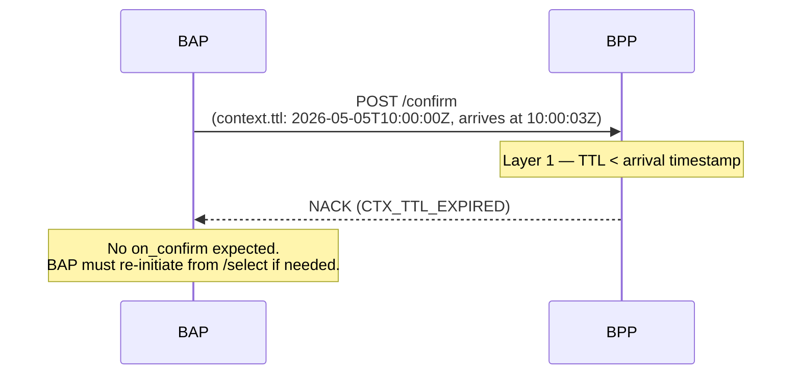

###### W2: DS Overloaded — Synchronous NACK with Retry

The BAP calls `discover` during a traffic spike. The DS is at capacity and cannot queue additional requests. The DS NACKs with `NET_OVERLOADED`. The BAP retries with exponential backoff.

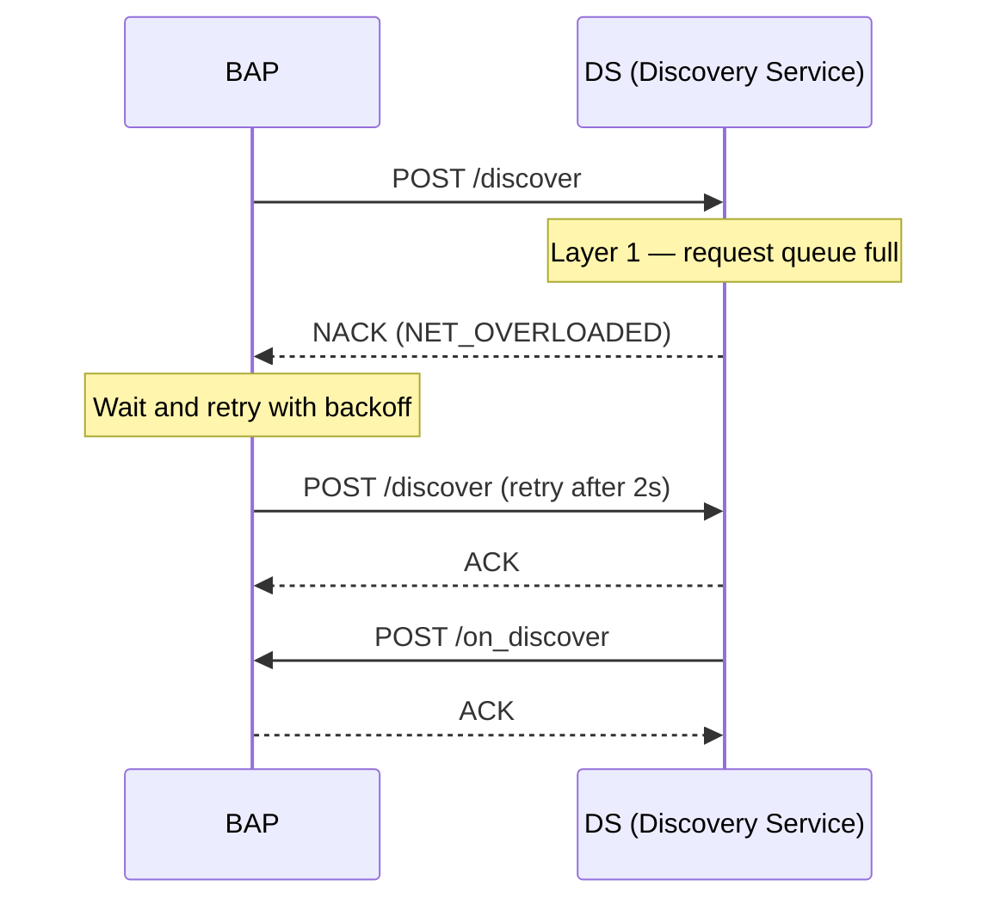

##### Layer 2 — Trust

###### W3: Key Rotation Cache Mismatch — NACK

The BAP rotates its signing key pair and updates the Registry. The BPP still holds the old public key in its local cache. When the BAP sends a signed `init`, the BPP verifies the signature against the stale cached key — verification fails. This is an exception (cache staleness) that becomes an authentication error. The BAP may retry once the BPP cache expires or the BPP is forced to re-lookup from the Registry.

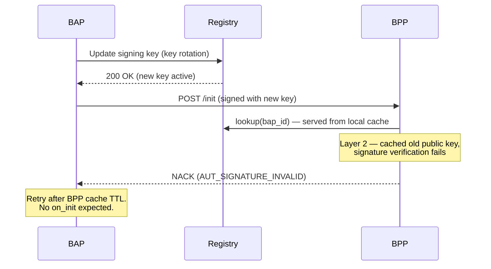

###### W4: Replay Attack Detected — NACK

An attacker captures a valid `select` request and replays it. The BPP detects the duplicate `message_id` and rejects the replayed message.

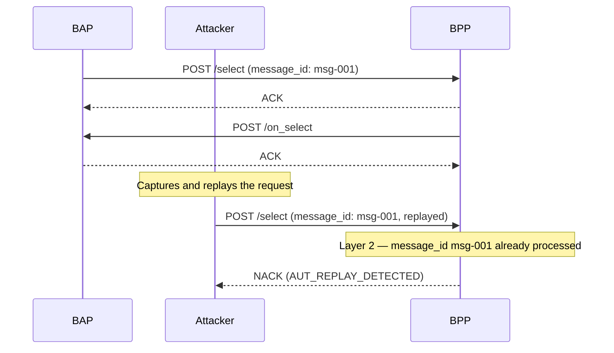

##### Layer 3 / 4 — Core Data and Linked Data

###### W5: Invalid Field Format — NACK

The BAP sends a `select` with a `fulfillment.time.timestamp` field formatted as `DD-MM-YYYY` instead of ISO 8601. The BPP's JSON schema validator rejects it at the Core Data layer.

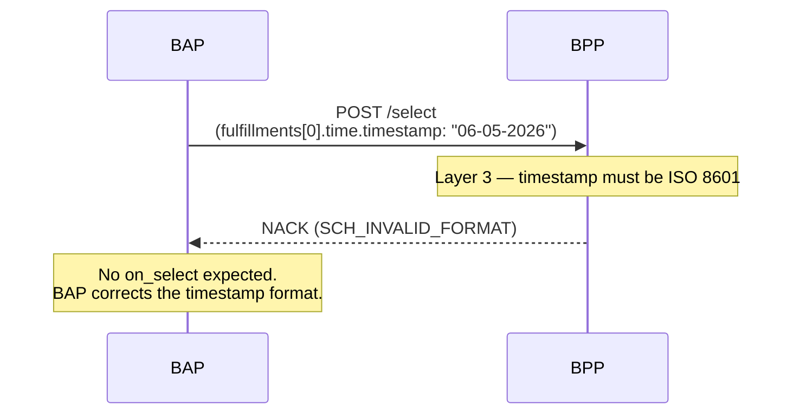

###### W6: Domain Attribute Pack Validation Failure — NACK

The BAP sends a `discover` request with an `itemAttributes` payload for the energy domain that contains an attribute key (`powerOutput_kVA`) not defined in the registered `energy:Item` attribute pack schema. The DS rejects it at the Linked Data layer (Layer 4).

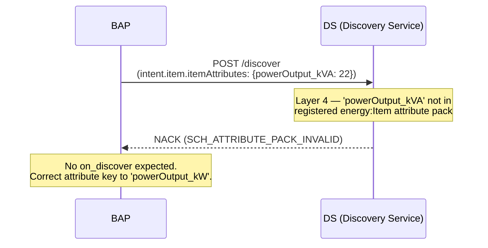

##### Layer 5 — Policy

###### W7: Cancellation Window Expired — Async Error

The BAP calls `cancel` on an order whose cancellation window closed 2 hours ago per the provider's policy. The BPP accepts the request (ACK), evaluates it at the Policy layer, and returns the rejection asynchronously via `on_cancel`. Note: this is an exception — the order is still active — but it becomes an error because the policy prevents resolution.

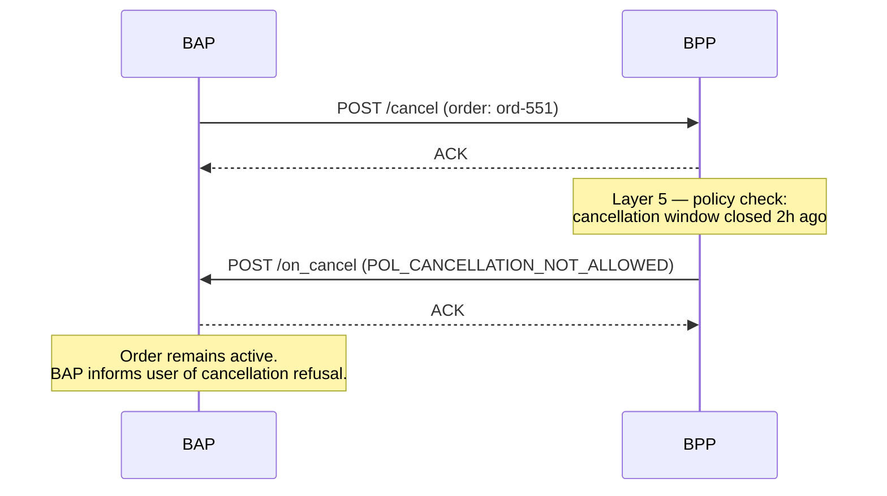

###### W8: KYC Required Before Confirm — Async Error

The BAP calls `confirm` for a regulated financial service. The BPP accepts the request but discovers during policy evaluation (Layer 5) that the user associated with the order has not completed mandatory KYC.

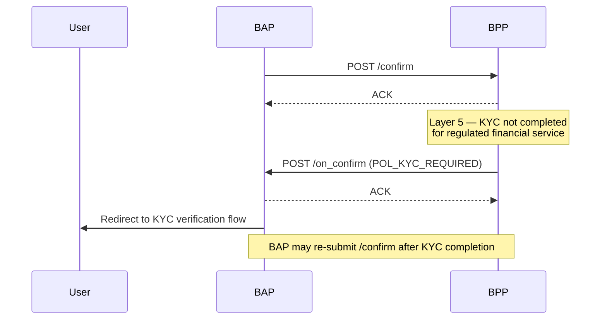

##### Layer 6 — Application

###### W9: Out of Stock During Select — Async Error

The BAP user adds items to the cart and the BAP calls `select`. The BPP checks live inventory at the Application layer and finds the requested quantity is unavailable. This is the exception escalating to an error because no alternatives exist.

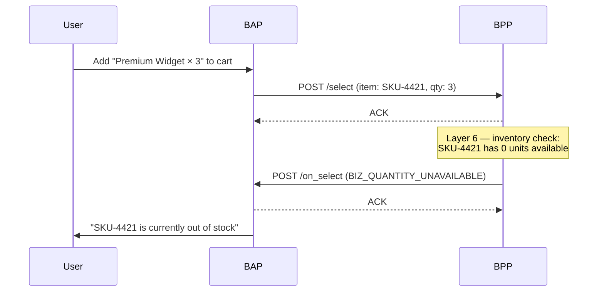

###### W10: Payment Failure with Level 2 Error — Async

The BAP calls `confirm` to finalise an order. The BPP accepts and initiates payment. The payment gateway returns a hard decline. The BPP wraps the payment error as a Level 2 error inside the canonical `BIZ_PAYMENT_FAILED`, preserving the gateway-specific decline code for diagnostic use.

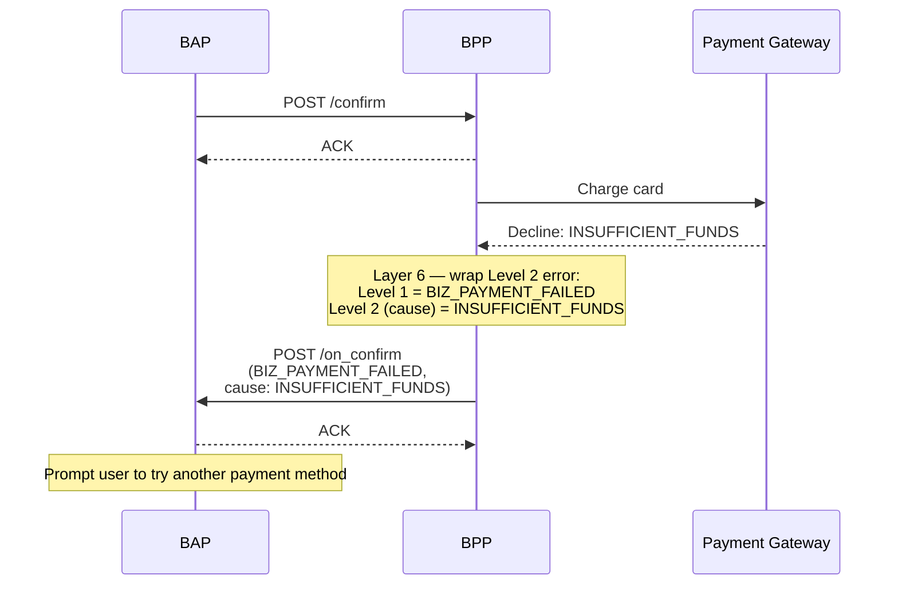

##### Cascaded Network Topology — Retail and Logistics

###### W11: Logistics Fulfilment Unavailable Propagated to Buyer

A BAP confirms a retail order that includes delivery. The Retail BPP acts as a BAP on a separate logistics network to procure a delivery slot. The Logistics BPP has no available agents for the requested window. The error cascades back to the buyer's BAP, with the logistics-layer error preserved as a Level 2 cause. This example illustrates a cascaded topology where the Retail BPP has a dual role — BPP to the buyer and BAP to the logistics provider.

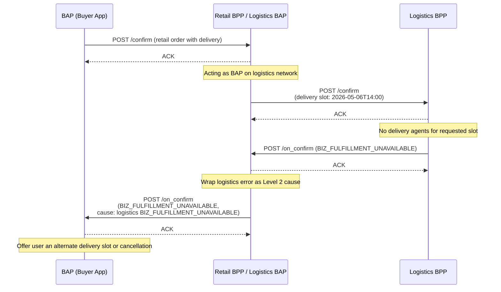

##### Hybrid Topology — EV Charging with P2P Energy Trading

The following two examples share the same network topology. A car infotainment system (BAP) books a charging session with an EV Charging BPP. The EV Charging BPP simultaneously acts as a BAP on two separate networks: a P2P Energy Trading network (sourcing green energy from a Prosumer BPP) and a Demand Flexibility network (registering a load-flexibility slot with a Demand Flexibility BPP). This is a hybrid topology — cascaded (infotainment → EV Charging BPP) plus parallel (EV Charging BPP → P2P Trading BPP and Demand Flexibility BPP simultaneously).

###### W12: EV Charger Goes Offline After Confirm

All three networks confirm successfully. Afterwards, the physical EVSE charger unit is blocked and reports a `FAULTED` status via OCPP. The EV Charging BPP notifies the infotainment BAP via `on_status` with an internal error, wrapping the OCPP fault as a Level 2 cause. The infotainment BAP initiates cancellation, which the EV Charging BPP propagates upstream to both its providers in parallel.

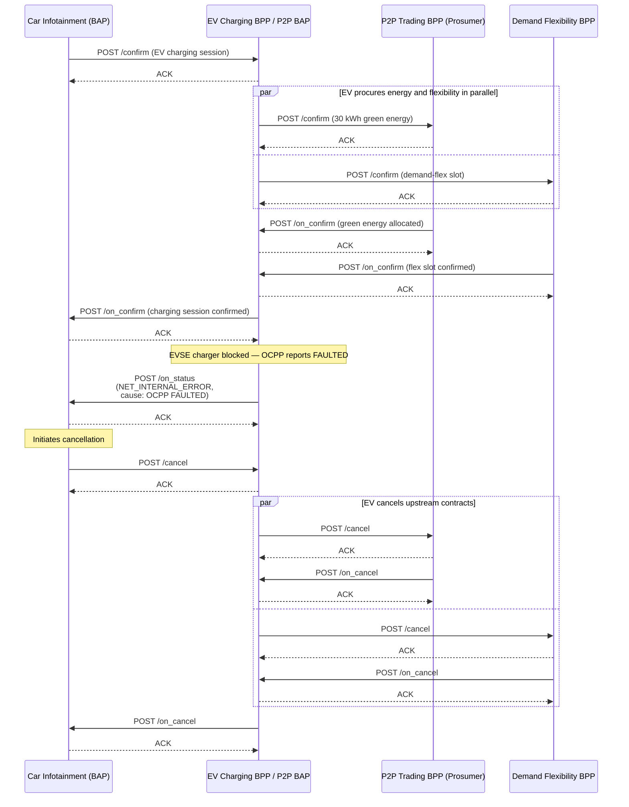

###### W13: Prosumer Cancels Due to Grid Outage

All three networks have confirmed the charging session. A transmission grid outage severs the Prosumer's renewable energy source. The Prosumer BPP cancels the energy allocation. The EV Charging BPP, unable to proceed without green energy, notifies the infotainment BAP via `on_update` that the session is disrupted. The BAP offers the user a fallback to grey grid energy, which the user accepts. The cascaded error is preserved using Level 2 chaining so that both NPs can synchronize their transaction state.

```mermaid
sequenceDiagram
    participant CAR as Car Infotainment (BAP)
    participant EV as EV Charging BPP / P2P BAP
    participant P2P as P2P Trading BPP (Prosumer)
    participant FLEX as Demand Flexibility BPP

    Note over CAR,FLEX: All parties have confirmed the charging session

    Note over P2P: Transmission grid outage —<br/>renewable source disconnected
    P2P->>EV: POST /on_cancel<br/>(BIZ_FULFILLMENT_UNAVAILABLE,<br/>cause: grid_outage)
    EV-->>P2P: ACK

    Note over EV: Green energy source cancelled;<br/>cannot fulfil committed EV session
    EV->>FLEX: POST /cancel (demand-flex slot no longer needed)
    FLEX-->>EV: ACK
    FLEX->>EV: POST /on_cancel
    EV-->>FLEX: ACK

    EV->>CAR: POST /on_update<br/>(BIZ_FULFILLMENT_UNAVAILABLE,<br/>cause: prosumer BIZ_FULFILLMENT_UNAVAILABLE)
    CAR-->>EV: ACK

    Note over CAR: Driver notified — offer grey energy fallback
    CAR->>EV: POST /update (accept grey energy alternative)
    EV-->>CAR: ACK
    EV->>CAR: POST /on_update (session updated: grey grid energy)
    CAR-->>EV: ACK
```

## Conclusion

This RFC establishes a comprehensive framework for handling exceptions and errors in Beckn Protocol v2. It draws a clear distinction between exceptions — deviations that may be resolved gracefully within the protocol flow — and errors, which halt processing and always result in an `Error` object being transmitted. The canonical, layered error code taxonomy is aligned with the six layers of the Beckn Protocol Stack (CTX/NET → Networking, AUT → Trust, SCH → Core Data / Linked Data, POL → Policy, BIZ → Application). The self-referencing `Error` schema enables structured root-cause chains — including Level 2 errors from higher-layer integrations such as payments, tracking, and consent management — with the invariant that the Level 1 error is always canonical. NACK obligations are explicit: BAPs MUST NOT expect callbacks after receiving a NACK, and BPPs MUST retry callbacks that are NACKed per NFO policy. Responding NPs additionally hold engagement-level agency through the discretionary NACK mechanism, allowing policy-governed refusals based on caller trust, capacity, or availability, subject to NFO constraints. Strongly recommended synchronous dispatch for context, authentication, and schema errors reduces diagnostic ambiguity. Full backward-compatibility mappings from [BECKN-005](https://github.com/beckn/protocol-specifications/blob/master/docs/BECKN-005-Error-Codes-Draft-01.md) ensure smooth migration for existing implementations.

Advancement to Candidate status requires at least two independent implementations validating the canonical enum, the `x-error-registry` metadata, and the ACK/NACK semantics defined in the Error Handling Guidelines.

### Open Questions

1. Should `DOM_*` prefix codes be defined centrally in this RFC (as a reserved namespace) or delegated entirely to domain-specific specifications? If delegated, what governance process ensures uniqueness?
2. Should `BIZ_GENERIC_ERROR` and `POL_GENERIC_ERROR` be formally removed from the canonical enum, or retained as deprecated entries indefinitely for legacy tooling compatibility?
3. What is the recommended freshness threshold for `NET_CATALOG_STALE`, and should it be configurable per network policy?
4. Should the exceptional cases for asynchronous dispatch of `AUT_*` errors (key revocation, SSL failure, etc.) be normative or remain informative guidance?

## Acknowledgements

This RFC is based on the proposal by [Abhishek Jain (abhimail)](https://github.com/abhimail) posted in [discussion #148](https://github.com/beckn/protocol-specifications-v2/discussions/148), with additional contributions from [Mayuresh Nirhali (nirmay)](https://github.com/nirmay), [Networks for Humanity Foundation](https://networksforhumanity.org) (original discussion author) and [Ravi Prakash (ravi-prakash-v)](https://github.com/ravi-prakash-v) (protocol stack layer alignment, sync/async dispatch guidance, Level 2 error semantics). Thanks to [Ameet Deshpande (ameetdesh)](https://github.com/ameetdesh), [Networks for Humanity Foundation](https://networksforhumanity.org), and all Beckn working group members who provided feedback.

## References

- **[BECKN-005](https://github.com/beckn/protocol-specifications/blob/master/docs/BECKN-005-Error-Codes-Draft-01.md) (v1 Error Codes)**
- **NFH-003: The Beckn Protocol Stack:** Click [here](./The_Beckn_Protocol_Stack.md).
- **NFH-006: Beckn API Endpoints (v2.0.0):** Click [here](./API.md).
- **NFH-007: Navigating the Beckn Schema:** Click [here](./Core_Data_Schema.md).
- **Governance:** Click [here](../GOVERNANCE.md).
- **Keyword definitions:** Click [here](./Keyword_Definitions.md).
- **Discussion #148:** [https://github.com/beckn/protocol-specifications-v2/discussions/148](https://github.com/beckn/protocol-specifications-v2/discussions/148)
