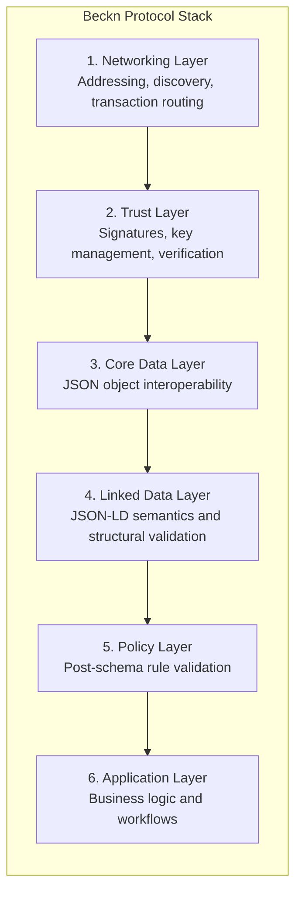
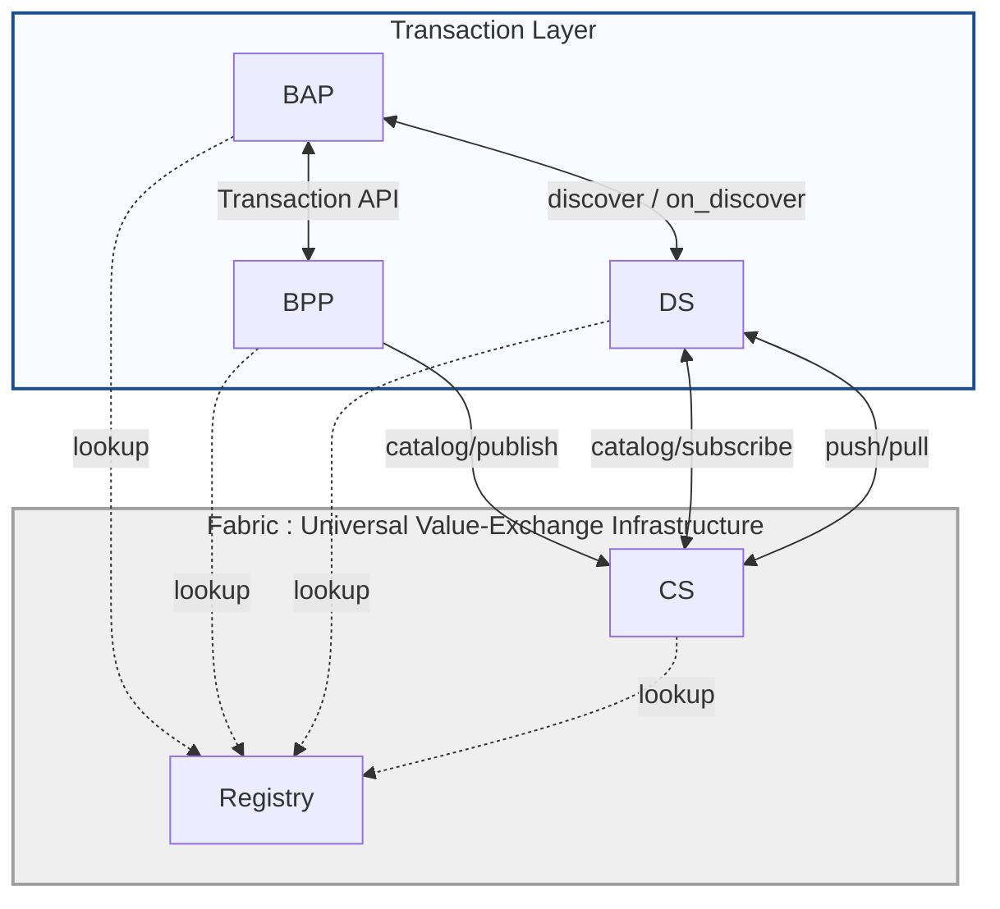
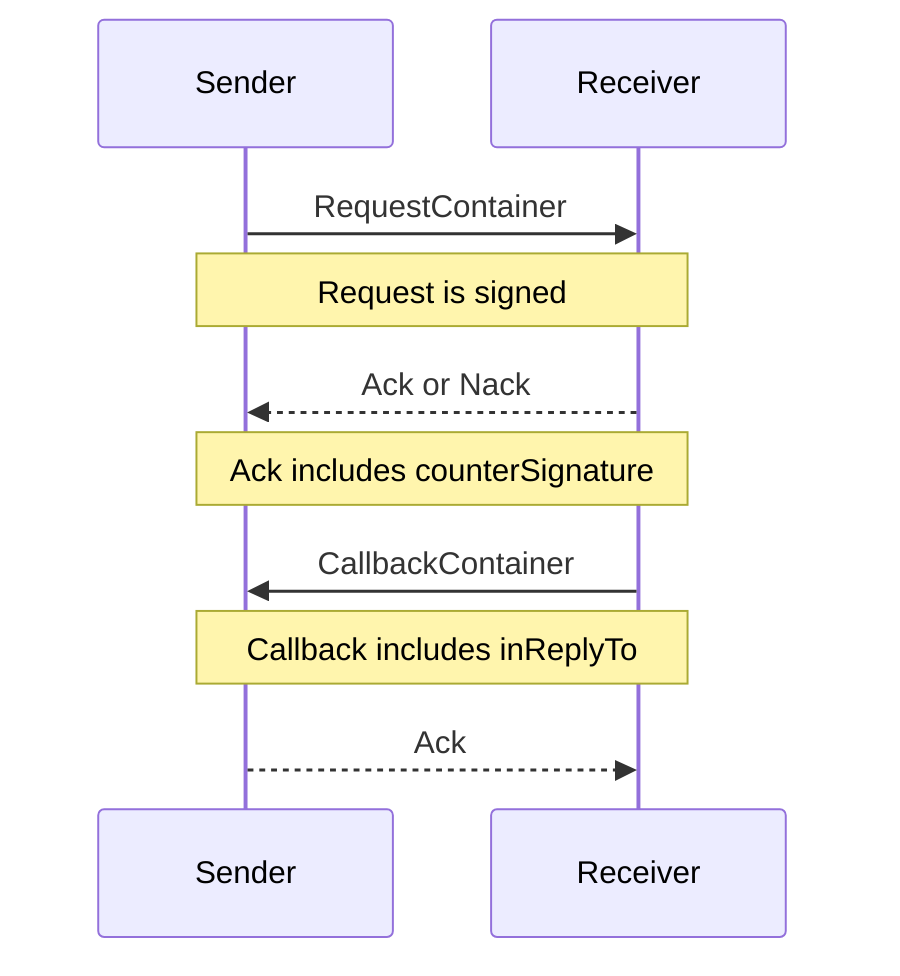
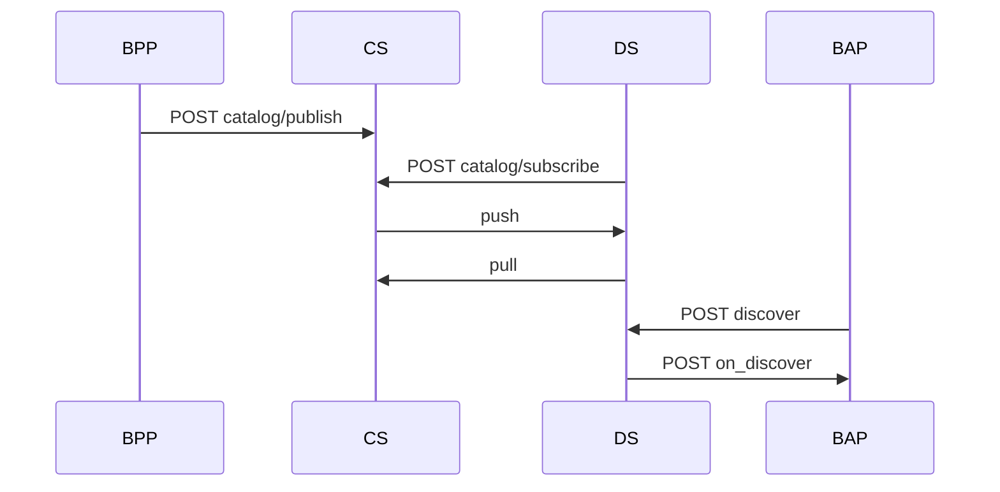

# The Beckn Protocol Stack

## Document Details

- **ID:** NFH-003
- **Status:** Draft.
- **Authors:** Beckn Protocol contributors.
- **Created:** 2026-04-10.
- **Updated:** 2026-04-10.
- **Version history:** Repository history on `main` does not yet show commits for this file; Draft-01 (2026-04-10) migrated the protocol stack guide into RFC template structure.
- **Latest editor's draft:** Click [here](https://github.com/beckn/protocol-specifications-v2/blob/draft/docs/03_The_Beckn_Protocol_Stack.md).
- **Implementation report:** Informative RFC; no standalone implementation report required.
- **Stress test report:** Not applicable for this architecture-overview RFC.
- **Conformance impact:** Informative with normative guidance for layer responsibilities.
- **Security/privacy implications:** Clarifies trust-layer and signature responsibilities across the stack.
- **Replaces / relates to:** Replaces non-RFC-form content in `03_The_Beckn_Protocol_Stack.md`.
- **Feedback:** Issues Click [here](https://github.com/beckn/protocol-specifications-v2/issues?q=is%3Aissue+label%3A%22RFC-003%22), discussions Click [here](https://github.com/beckn/protocol-specifications-v2/discussions?discussions_q=label%3A%22RFC-003%22), pull requests Click [here](https://github.com/beckn/protocol-specifications-v2/pulls?q=is%3Apr+label%3A%22RFC-003%22).
- **Errata:** To be published.

## Abstract

This RFC defines the Beckn v2 protocol stack as six layers and explains how networking, trust, data, semantics, policy, and application concerns interact to provide a consistent implementation model across participants.

## Table of Contents

- [The Beckn Protocol Stack](#the-beckn-protocol-stack)
  - [Document Details](#document-details)
  - [Abstract](#abstract)
  - [Table of Contents](#table-of-contents)
  - [Introduction](#introduction)
  - [Specification](#specification)
    - [Stack definition](#stack-definition)
    - [Layer 1: Networking Layer](#layer-1-networking-layer)
      - [Network Architecture](#network-architecture)
      - [Endpoint Pattern and Action Surface](#endpoint-pattern-and-action-surface)
      - [Request Modes and Message Exchange](#request-modes-and-message-exchange)
      - [Discovery on Beckn](#discovery-on-beckn)
    - [Layer 2: Trust Layer](#layer-2-trust-layer)
    - [Layer 3: Core Data Layer](#layer-3-core-data-layer)
    - [Layer 4: Linked Data Layer](#layer-4-linked-data-layer)
    - [Layer 5: Policy Layer](#layer-5-policy-layer)
    - [Layer 6: Application Layer](#layer-6-application-layer)
    - [Interaction examples](#interaction-examples)
    - [Conformance requirements](#conformance-requirements)
    - [Security considerations](#security-considerations)
    - [Migration notes](#migration-notes)
  - [Conclusion](#conclusion)
  - [Acknowledgements](#acknowledgements)
  - [References](#references)

## Introduction

Beckn implementations involve multiple independently operated actors and services, and without a canonical layering model responsibilities can blur across transport, trust, data, semantics, policy, and business workflow concerns. This RFC establishes a shared architecture baseline so implementations remain coherent and interoperable across BAP, BPP, DS, PS, Registry, and related infrastructure.

In this layering model, the Networking Layer handles routing, addressing, discovery flow, and request/callback movement; the Trust Layer handles identity resolution, signature verification, key management, and non-repudiation controls; the Core Data Layer handles structural payload interoperability using JSON and schema validation; the Linked Data Layer handles JSON-LD semantics for extensibility and shared meaning; the Policy Layer handles runtime rule enforcement beyond core schema constraints; and the Application Layer handles participant-specific business logic and workflow execution.

The stack is guided by four implementation principles: each layer MUST own a clearly defined set of responsibilities, shared contracts and semantics SHOULD be interpreted consistently across participants, request acknowledgement and callback completion patterns SHOULD be preserved for async-ready exchanges, and signature verification with trust lookup MUST be treated as first-class runtime behavior.

## Specification

The key words MUST, SHOULD, and MAY in this document are to be interpreted as described in Click [here](./00_Keyword_Definitions.md).

### Stack definition

Beckn v2 architecture is defined as a six-layer stack:

1. Networking Layer
2. Trust Layer
3. Core Data Layer
4. Linked Data Layer
5. Policy Layer
6. Application Layer



### Layer 1: Networking Layer

The networking layer defines how participants are arranged and how requests, callbacks, and discovery traffic move between them.

#### Network Architecture

A Beckn network is a set of independently run platforms that communicate through common protocol contracts.

In Beckn v2, the runtime can be viewed as two architectural bands:

1. **Open Network Layer (top):** BAP, BPP, DS  
2. **Universal Value-Exchange Infrastructure Fabric (bottom):** Registry, Cataloging Service (CS)



The key networking shift in v2 is catalog-first discovery. Discovery does not depend on live multicast fan-out.

#### Endpoint Pattern and Action Surface

Beckn endpoints follow a simple action/callback pairing pattern:

```text
/discover, /on_discover, /select, /on_select, and related action endpoints
```

Typical role endpoints include:

- `/discover`
- `/on_discover`
- `/select`
- `/on_select`
- `/confirm`
- `/on_confirm`

Action support depends on the participant role and network policy.

#### Request Modes and Message Exchange

Beckn v2 supports three transport request modes:

1. `POST` for normal forward requests and callbacks  
2. `GET` mode with JSON body for Discovery Service 
3. `GET` mode with query parameters request and signature are URL-contained

The standard exchange pattern is:

1. Signed request is sent  
2. Receiver returns `Ack` or `Nack` immediately  
3. Business result returns later via callback in most flows  
4. Callback carries `inReplyTo` for correlation  
5. `Ack` may carry `counterSignature` as signed receipt



In `GET Query` mode, the server only returns acknowledgement and does not send asynchronous callbacks.

#### Discovery on Beckn

Discovery in Beckn is performed via the synchronization of two actors, Cataloging Service (on Fabric) and the Discovery Service (on Network):

1. The **Beckn Provider Platform** (BPP) publishes / updates catalogs on the **Cataloging Service** (CS) hosted on the **Fabric**
2. The **Cataloging Service** validates and indexes catalogs  
3. The **Discovery Service** (DS) subscribes to various catalogs across various discovery scopes 
4. The **Discovery Service** (DS) syncs the catalogs from **Cataloging Service** (CS))
5. The **Beckn Application Platform** (BAP) calls `discover` on DS  
6. The **Discovery Service** (DS) returns matching results (sync or callback per policy)


### Layer 2: Trust Layer

The trust layer provides identity and non-repudiation controls.

- The NFH Fabric contains a Registry service that MUST be used as a trust directory for identity, endpoint, and key resolution.
- Open Network Participants (BAP, BPP, DS) MUST lookup the Registry using DeDi protocol
- Receivers MUST verify signatures against trusted key material returned from the Registry `lookup`

### Layer 3: Core Data Layer

The core data layer defines structural interoperability.

- Payloads MUST preserve envelope fields such as `context` and `message`.
- Core objects MUST be validated with JSON Schema/OpenAPI constraints.
- Callback correlation SHOULD use `inReplyTo`.

### Layer 4: Linked Data Layer

The linked data layer defines semantic interoperability through JSON-LD.

- `Attribute` extension points MAY carry JSON-LD structures.
- `@context` and `@type` SHOULD be used for semantic interpretation.
- Structural validation and semantic validation are complementary and SHOULD both be applied.

### Layer 5: Policy Layer

The policy layer governs runtime behavior outside core schema structure.

Examples include:

1. Sync vs async callback behavior by action.
2. Mandatory/optional action groups by network.
3. Ranking, filtering, and discovery constraints.
4. Timeout/TTL and acknowledgement expectations.

### Layer 6: Application Layer

The application layer contains participant workflows and business logic.

Typical lifecycle groups:

- Discovery: `discover`, `on_discover`.
- Contracting: `select`, `on_select`, `init`, `on_init`, `confirm`, `on_confirm`.
- Fulfillment: `status`, `on_status`, `update`, `on_update`, `track`, `on_track`, `cancel`, `on_cancel`.
- Post-fulfillment: `rate`, `on_rate`, `support`, `on_support`.
- Infrastructure: `publish`, trust lookups.

### Interaction examples

Example 1 - Discovery to transaction path:

```text
BPP -> CS (publish)
BP -> DS (index)
BAP -> DS (discover)
BAP <-> BPP (select/init/confirm/.../support lifecycle)
```

Example 2 - Envelope shape:

```json
{
  "context": {
    "action": "discover",
    "version": "2.0.0",
    "transactionId": "txn-123",
    "messageId": "msg-456"
  },
  "message": {}
}
```

### Conformance requirements

| ID | Requirement | Level |
|---|---|---|
| CON-003-01 | Implementations MUST preserve the six-layer responsibility boundaries defined in this RFC. | MUST |
| CON-003-02 | Implementations MUST enforce signature verification and trust lookup behavior in the trust layer. | MUST |
| CON-003-03 | Implementations SHOULD preserve async acknowledgement/callback interaction semantics where defined by action policy. | SHOULD |

### Security considerations

This RFC emphasizes trust-layer controls including signature verification, key resolution, and signed acknowledgements. Misplacing these responsibilities outside the trust layer can create verification gaps and replay/non-repudiation weaknesses.

### Migration notes

This update migrates the document to RFC format. It does not introduce new wire-level protocol behavior.

## Conclusion

The Beckn protocol stack provides a consistent implementation model by separating networking, trust, structural data validation, semantic interpretation, policy enforcement, and application behavior into explicit layers. Future standardization work may still be useful for formal actor capability profiles and policy-layer conformance profiles across networks, but these questions do not change the stack definition established here.

## Acknowledgements

This RFC reflects contributions from Beckn Protocol contributors who developed and reviewed the architecture, interoperability, and trust-model guidance represented in this stack description.

## References

- Click [here](./00_Keyword_Definitions.md)
- Click [here](../api/v2.0.0/beckn.yaml)
- Click [here](https://docs.beckn.io/introduction-to-beckn/beckn-protocol)
- Click [here](https://docs.beckn.io/introduction-to-beckn/fabric-the-value-exchange-infrastructure)
